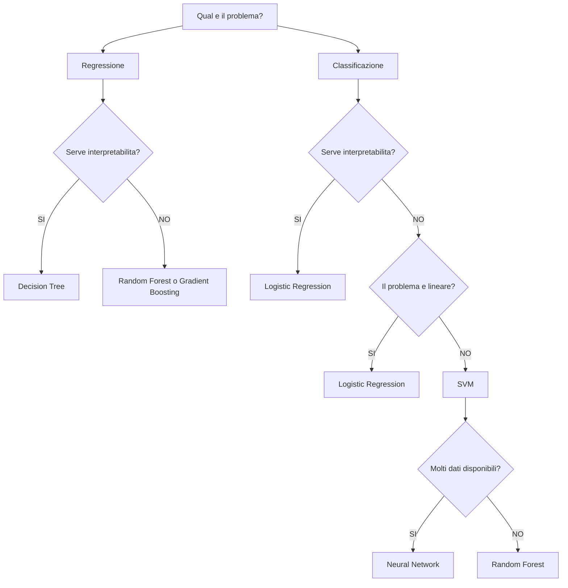
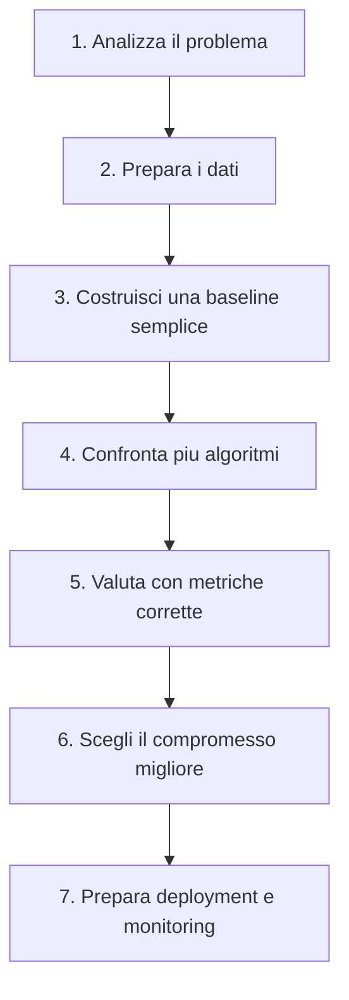

# Algorithm Selection Guide

> Una guida pratica per scegliere il modello di Machine Learning più adatto in base al problema, ai dati disponibili e ai requisiti del progetto.

---

## Scopo del documento

Uno degli errori più comuni quando si studia Machine Learning è concentrarsi esclusivamente sul funzionamento degli algoritmi senza capire **quando utilizzarli**.

Nella pratica professionale, la scelta del modello dipende da numerosi fattori:

- tipo di problema;
- quantità di dati;
- tipologia delle feature;
- interpretabilità richiesta;
- tempo di training;
- tempo di inferenza;
- disponibilità di risorse hardware;
- complessità del modello;
- facilità di manutenzione.

Questo documento vuole fornire una **guida decisionale**, utile sia durante lo studio sia nello sviluppo di progetti reali.

---

## Workflow di scelta di un algoritmo

La scelta del modello può essere affrontata seguendo una sequenza di domande.

> 💡 **Nota**
>
> Questo flowchart rappresenta una linea guida generale.
> Nella pratica è sempre consigliabile confrontare più modelli tramite Cross Validation.

---

## Processo decisionale

Quando si affronta un nuovo problema di Machine Learning è utile porsi alcune domande.

## 1. Che tipo di problema sto risolvendo?

Prima di tutto occorre distinguere tra:

### Regressione

Il target è un valore continuo.

Esempi:

- prezzo di una casa;
- temperatura;
- fatturato previsto;
- consumo energetico.

Metriche tipiche:

- MAE
- MSE
- RMSE
- R²

---

### Classificazione

Il target è una categoria.

Esempi:

- spam / non spam;
- cliente insolvente;
- malattia presente / assente;
- riconoscimento immagini.

Metriche tipiche:

- Accuracy
- Precision
- Recall
- F1-score
- ROC-AUC

---

## 2. Quanti dati possiedo?

La quantità di dati influenza fortemente la scelta del modello.

| Dimensione dataset | Modelli consigliati |
|-------------------|---------------------|
| < 1.000 campioni | Logistic Regression, Decision Tree, SVM |
| 1.000 - 50.000 | Random Forest, SVM, Logistic Regression |
| > 50.000 | Random Forest, Gradient Boosting, Neural Networks |
| Milioni di esempi | Deep Learning |

---

## 3. È importante spiegare il modello?

In alcuni settori (finanza, sanità, assicurazioni) è fondamentale spiegare perché il modello ha preso una decisione.

In questi casi è preferibile scegliere modelli interpretabili.

Ottimi esempi:

- Logistic Regression
- Decision Tree

Meno interpretabili:

- Random Forest
- Neural Networks
- SVM con kernel

---

## 4. Quanto deve essere veloce la predizione?

Esistono algoritmi con training lento ma inferenza veloce e viceversa.

Ad esempio:

| Algoritmo | Training | Inferenza |
|-----------|---------:|----------:|
| Logistic Regression | ⭐⭐ | ⭐⭐⭐⭐⭐ |
| Naive Bayes | ⭐⭐⭐⭐⭐ | ⭐⭐⭐⭐⭐ |
| KNN | ⭐⭐⭐⭐⭐ | ⭐ |
| SVM | ⭐⭐ | ⭐⭐⭐ |
| Decision Tree | ⭐⭐⭐⭐ | ⭐⭐⭐⭐⭐ |
| Random Forest | ⭐⭐ | ⭐⭐⭐⭐ |
| Neural Network | ⭐ | ⭐⭐⭐⭐ |

Maggiore è il numero di stelle, maggiore è la velocità.

---

## 5. Le feature hanno scale molto diverse?

Se alcune feature assumono valori molto maggiori rispetto ad altre, è necessario chiedersi se l'algoritmo utilizza misure di distanza.

In questo caso potrebbe essere indispensabile applicare:

- Standardizzazione
- Normalizzazione

Gli algoritmi più sensibili sono:

- KNN
- SVM
- Logistic Regression

Molto meno sensibili:

- Decision Tree
- Random Forest

---

## Tabella comparativa degli algoritmi

| Algoritmo | Tipo | Lineare | Scaling | Interpretabile | Probabilità | Training | Inferenza | Dataset ideale |
|-----------|------|----------|----------|----------------|-------------|-----------|------------|----------------|
| Logistic Regression | Classificazione | ✅ | ✅ | ⭐⭐⭐⭐⭐ | ✅ | Veloce | Molto veloce | Piccolo/Medio |
| Naive Bayes | Classificazione | No | No | ⭐⭐⭐⭐ | ✅ | Molto veloce | Molto veloce | Testo |
| KNN | Class./Regr. | No | ✅ | ⭐⭐⭐ | No | Quasi nullo | Lenta | Piccolo |
| SVM | Class./Regr. | Dipende dal kernel | ✅ | ⭐⭐ | Limitata | Medio | Medio | Piccolo/Medio |
| Decision Tree | Class./Regr. | No | No | ⭐⭐⭐⭐⭐ | Limitata | Veloce | Molto veloce | Piccolo/Medio |
| Random Forest | Class./Regr. | No | No | ⭐⭐⭐ | Limitata | Medio | Veloce | Medio/Grande |
| Neural Network | Class./Regr. | No | ✅ | ⭐ | Sì (Softmax/Sigmoid) | Lento | Veloce | Grande |

---

## Confronto rapido

| Se hai bisogno di... | Algoritmo consigliato |
|-----------------------|-----------------------|
| Massima interpretabilità | Decision Tree |
| Baseline semplice | Logistic Regression |
| Classificazione testuale | Naive Bayes |
| Dataset tabellari | Random Forest |
| Dataset piccoli ma complessi | SVM |
| Problemi basati sulla distanza | KNN |
| Immagini, audio e testo complesso | Neural Networks |

---

## Prima di scegliere un algoritmo

Rispondi a queste domande:

- Il problema è di classificazione o regressione?
- Quanti dati sono disponibili?
- I dati sono sbilanciati?
- È richiesta interpretabilità?
- Servono probabilità?
- È disponibile molta potenza di calcolo?
- Il modello dovrà lavorare in tempo reale?
- È più importante la precisione o la velocità?
- È previsto un retraining periodico?
- Il modello dovrà essere monitorato in produzione?

> ⚠️ **Attenzione**
>
> Non esiste un algoritmo migliore in assoluto.
>
> Il modello migliore è quello che offre il miglior compromesso tra accuratezza, interpretabilità, costo computazionale e requisiti del progetto.

---

## Nei prossimi capitoli

Nei paragrafi successivi verrà analizzato ogni algoritmo singolarmente, descrivendo:

- quando utilizzarlo;
- quando evitarlo;
- vantaggi;
- svantaggi;
- iperparametri principali;
- complessità computazionale;
- errori più comuni;
- casi d'uso reali;
- confronto con gli altri algoritmi.

---

## Schede degli algoritmi

Questa sezione analizza i principali algoritmi studiati nel Master AI Engineering dal punto di vista della scelta pratica.

Per ogni algoritmo vengono indicati:

- quando utilizzarlo;
- quando evitarlo;
- vantaggi;
- svantaggi;
- iperparametri principali;
- requisiti di preprocessing;
- errori tipici;
- alternative possibili.

---

## Logistic Regression

La **Logistic Regression** è uno degli algoritmi più importanti da conoscere perché rappresenta una baseline semplice, veloce e interpretabile per problemi di classificazione.

Nonostante il nome, non viene usata principalmente per problemi di regressione, ma per stimare la probabilità di appartenenza a una classe.

---

## Quando usarla

Usa Logistic Regression quando:

- il problema è di classificazione binaria;
- serve un modello semplice e veloce;
- è importante interpretare il contributo delle feature;
- vuoi ottenere probabilità facilmente leggibili;
- vuoi costruire una baseline robusta;
- il dataset non è troppo complesso;
- la relazione tra feature e target è approssimativamente lineare.

---

## Quando evitarla

Evitala quando:

- il problema presenta relazioni fortemente non lineari;
- le feature interagiscono in modo complesso;
- il dataset contiene immagini, audio o testo complesso non già trasformato;
- l'obiettivo principale è massimizzare la performance a scapito dell'interpretabilità;
- sono disponibili molti dati e modelli più espressivi possono essere sfruttati.

---

## Vantaggi

| Vantaggio | Descrizione |
|----------|-------------|
| Interpretabile | I coefficienti indicano il contributo delle feature |
| Veloce | Training e inferenza sono rapidi |
| Probabilistica | Restituisce probabilità di classe |
| Buona baseline | Ottima prima scelta per classificazione binaria |
| Semplice | Facile da spiegare e mantenere |

---

## Svantaggi

| Svantaggio | Descrizione |
|-----------|-------------|
| Lineare | Fatica con relazioni molto complesse |
| Sensibile allo scaling | Feature su scale diverse possono creare problemi |
| Sensibile alla multicollinearità | Feature fortemente correlate possono rendere instabili i coefficienti |
| Limitata capacità espressiva | Non adatta a pattern molto non lineari |

---

## Iperparametri principali

| Iperparametro | Significato |
|--------------|-------------|
| `C` | Inverso della forza di regolarizzazione |
| `penalty` | Tipo di regolarizzazione, ad esempio L1 o L2 |
| `solver` | Algoritmo di ottimizzazione |
| `max_iter` | Numero massimo di iterazioni |

---

## Feature scaling

La Logistic Regression beneficia quasi sempre dello scaling.

Tecniche consigliate:

- StandardScaler;
- MinMaxScaler.

Lo scaling aiuta soprattutto quando il modello viene addestrato tramite metodi iterativi basati sul gradiente.

---

## Errori tipici

- Usarla su dati fortemente non lineari senza trasformazioni.
- Interpretare i coefficienti senza aver scalato le feature.
- Usare solo Accuracy su dataset sbilanciati.
- Non controllare la convergenza del solver.
- Non distinguere probabilità predetta e classe finale.

---

## Alternative

| Se Logistic Regression non basta | Possibile alternativa |
|----------------------------------|----------------------|
| Relazioni non lineari | SVM con kernel, Random Forest |
| Dataset tabellare complesso | Random Forest |
| Moltissimi dati non strutturati | Neural Network |
| Testo semplice | Naive Bayes |

---

## Naive Bayes

**Naive Bayes** è un algoritmo probabilistico basato sul Teorema di Bayes e sull'ipotesi di indipendenza condizionata tra le feature.

È estremamente veloce, semplice e sorprendentemente efficace in molti problemi di classificazione testuale.

---

## Quando usarlo

Usa Naive Bayes quando:

- il problema riguarda classificazione testuale;
- vuoi una baseline molto veloce;
- il dataset è piccolo o medio;
- le feature rappresentano parole, token o frequenze;
- ti serve un modello probabilistico semplice;
- il tempo di training deve essere minimo.

Esempi tipici:

- spam detection;
- sentiment analysis di base;
- classificazione documentale;
- categorizzazione di email;
- classificazione di recensioni.

---

## Quando evitarlo

Evitalo quando:

- le feature sono fortemente correlate;
- l'ipotesi di indipendenza è troppo irrealistica per il problema;
- servono relazioni complesse tra variabili;
- vuoi la massima accuratezza su dati tabellari complessi;
- il problema richiede interpretazioni molto fini delle interazioni tra feature.

---

## Vantaggi

| Vantaggio | Descrizione |
|----------|-------------|
| Molto veloce | Training quasi immediato |
| Funziona bene sul testo | Ottimo con Bag of Words e TF-IDF |
| Semplice | Facile da implementare e spiegare |
| Buona baseline | Utile come primo modello |
| Robusto con pochi dati | Può funzionare bene anche con dataset non enormi |

---

## Svantaggi

| Svantaggio | Descrizione |
|-----------|-------------|
| Ipotesi naive | Assume indipendenza tra feature |
| Probabilità non sempre calibrate | Le probabilità possono essere poco realistiche |
| Limitato su pattern complessi | Non modella bene interazioni articolate |
| Sensibile a feature rare | Serve smoothing per evitare probabilità nulle |

---

## Varianti principali

| Variante | Quando usarla |
|---------|---------------|
| GaussianNB | Feature continue approssimativamente gaussiane |
| MultinomialNB | Conteggi o frequenze, tipicamente testo |
| BernoulliNB | Feature binarie presenza/assenza |

---

## Feature scaling

Naive Bayes generalmente **non richiede scaling**, perché non si basa su distanze geometriche.

La scelta corretta della variante è più importante dello scaling.

---

## Errori tipici

- Usare GaussianNB su dati testuali a conteggio.
- Non applicare smoothing con feature rare.
- Interpretare le probabilità come perfettamente calibrate.
- Dimenticare che l'ipotesi di indipendenza è una semplificazione.
- Confrontarlo con modelli complessi senza considerare il vantaggio di velocità.

---

## Alternative

| Se Naive Bayes non basta | Possibile alternativa |
|--------------------------|----------------------|
| Testo con feature TF-IDF | Logistic Regression |
| Testo complesso | Neural Network / Transformer |
| Dati tabellari | Random Forest |
| Relazioni non lineari | SVM con kernel |

---

## K-Nearest Neighbors

**K-Nearest Neighbors** è un algoritmo basato sulla distanza.

Non costruisce un vero modello durante il training, ma memorizza i dati e classifica nuovi esempi osservando i vicini più prossimi.

Per questo viene definito un algoritmo **lazy**.

---

## Quando usarlo

Usa KNN quando:

- il dataset è piccolo;
- vuoi una baseline semplice;
- il concetto di similarità tra esempi è significativo;
- le feature sono numeriche e ben scalate;
- vuoi un algoritmo facile da spiegare;
- il tempo di training deve essere quasi nullo.

---

## Quando evitarlo

Evitalo quando:

- il dataset è molto grande;
- la latenza di inferenza è critica;
- il numero di feature è molto elevato;
- le feature non sono scalate;
- sono presenti molti outlier;
- la memoria disponibile è limitata.

---

## Vantaggi

| Vantaggio | Descrizione |
|----------|-------------|
| Semplice | Molto facile da comprendere |
| Training quasi nullo | Non apprende parametri complessi |
| Flessibile | Può modellare confini non lineari |
| Utile come baseline | Buono per prototipi e dataset piccoli |

---

## Svantaggi

| Svantaggio | Descrizione |
|-----------|-------------|
| Inferenza lenta | Deve confrontare il nuovo punto con molti esempi |
| Sensibile allo scaling | Le distanze dipendono dalla scala delle feature |
| Sensibile agli outlier | Vicini rumorosi possono alterare la predizione |
| Curse of dimensionality | In molte dimensioni le distanze diventano meno informative |
| Memoria elevata | Deve mantenere il dataset di training |

---

## Iperparametri principali

| Iperparametro | Significato |
|--------------|-------------|
| `n_neighbors` | Numero di vicini considerati |
| `metric` | Distanza utilizzata |
| `weights` | Peso uniforme o basato sulla distanza |

---

## Feature scaling

KNN richiede quasi sempre scaling.

Tecniche consigliate:

- StandardScaler;
- MinMaxScaler.

Senza scaling, una feature con valori molto grandi può dominare completamente la distanza.

---

## Errori tipici

- Usare KNN su dataset enormi.
- Non scalare le feature.
- Scegliere `K = 1` senza validazione.
- Ignorare la dimensionalità del dataset.
- Usarlo quando serve inferenza in tempo reale su grandi volumi.

---

## Alternative

| Se KNN non è adatto | Possibile alternativa |
|---------------------|----------------------|
| Dataset grande | Logistic Regression, Random Forest |
| Dataset tabellare | Random Forest |
| Confini complessi ma pochi dati | SVM |
| Serve interpretabilità | Decision Tree |

---

## Support Vector Machine

La **Support Vector Machine** cerca di trovare l'iperpiano che separa le classi massimizzando il margine.

È particolarmente efficace su dataset piccoli o medi e può gestire confini non lineari tramite kernel.

---

## Quando usarla

Usa SVM quando:

- il dataset è piccolo o medio;
- vuoi un classificatore molto robusto;
- le classi sono separabili con un buon margine;
- hai bisogno di modellare confini non lineari;
- puoi permetterti tuning degli iperparametri;
- le feature sono numeriche e scalate.

---

## Quando evitarla

Evitala quando:

- il dataset è molto grande;
- serve massima interpretabilità;
- vuoi probabilità ben calibrate senza passaggi aggiuntivi;
- non puoi eseguire tuning;
- la latenza o il costo computazionale sono vincoli molto stringenti.

---

## Vantaggi

| Vantaggio | Descrizione |
|----------|-------------|
| Margine massimo | Buona capacità di generalizzazione |
| Kernel trick | Gestisce confini non lineari |
| Efficace con pochi dati | Spesso performante su dataset medio-piccoli |
| Robusta | Può gestire bene separazioni complesse |

---

## Svantaggi

| Svantaggio | Descrizione |
|-----------|-------------|
| Tuning delicato | `C`, `gamma` e kernel sono importanti |
| Scaling necessario | Molto sensibile alla scala delle feature |
| Poco interpretabile | Soprattutto con kernel non lineari |
| Costosa su dataset grandi | Training può diventare pesante |
| Probabilità non native | Serve calibrazione per probabilità affidabili |

---

## Iperparametri principali

| Iperparametro | Significato |
|--------------|-------------|
| `C` | Compromesso tra margine e penalizzazione errori |
| `kernel` | Tipo di trasformazione implicita |
| `gamma` | Influenza dei punti nel kernel RBF |
| `degree` | Grado del kernel polinomiale |

---

## Feature scaling

SVM richiede quasi sempre scaling.

Motivo:

- usa distanze;
- usa prodotti scalari;
- il margine dipende dalla geometria dello spazio.

Tecnica consigliata:

- StandardScaler.

---

## Errori tipici

- Usare SVM senza scaling.
- Usare kernel RBF senza validare `C` e `gamma`.
- Usarla su dataset enormi senza considerare il costo.
- Interpretarla come un modello probabilistico nativo.
- Non confrontarla con Logistic Regression come baseline lineare.

---

## Alternative

| Se SVM non è adatta | Possibile alternativa |
|---------------------|----------------------|
| Serve interpretabilità | Logistic Regression, Decision Tree |
| Dataset grande | Random Forest, Neural Network |
| Baseline rapida | Logistic Regression |
| Testo semplice | Naive Bayes |
| Dataset tabellare | Random Forest |

---

## Sintesi della Parte 2

| Algoritmo | Usalo quando | Evitalo quando |
|-----------|--------------|----------------|
| Logistic Regression | Serve baseline interpretabile e probabilistica | Relazioni molto non lineari |
| Naive Bayes | Classificazione testuale veloce | Feature molto correlate e pattern complessi |
| KNN | Dataset piccolo e similarità significativa | Dataset grande o molte feature |
| SVM | Dataset piccolo/medio con confini complessi | Dataset grande o richiesta alta interpretabilità |

---

## Collegamenti consigliati

Per approfondire questi algoritmi consulta:

- `logistic-regression.md`
- `naive-bayes.md`
- `nearest-neighbors.md`
- `svm.md`

---

## Decision Tree

Il **Decision Tree** è un algoritmo supervisionato che costruisce una struttura ad albero composta da regole decisionali.

Ogni nodo interno rappresenta una condizione su una feature, ogni ramo rappresenta l'esito della condizione e ogni foglia rappresenta una predizione.

È uno degli algoritmi più interpretabili, ma può facilmente andare in overfitting se non viene controllato.

---

## Quando usarlo

Usa Decision Tree quando:

- vuoi un modello molto interpretabile;
- devi spiegare le decisioni a utenti non tecnici;
- il dataset è piccolo o medio;
- le relazioni tra feature e target sono non lineari;
- vuoi costruire rapidamente una baseline comprensibile;
- vuoi visualizzare regole decisionali;
- il preprocessing deve rimanere semplice.

---

## Quando evitarlo

Evitalo quando:

- il dataset è molto rumoroso;
- serve massima stabilità predittiva;
- vuoi evitare overfitting senza tuning;
- il modello deve generalizzare molto bene su dati nuovi;
- piccole variazioni nei dati non devono cambiare molto il modello.

In questi casi, spesso è preferibile utilizzare una Random Forest.

---

## Vantaggi

| Vantaggio | Descrizione |
|----------|-------------|
| Molto interpretabile | Le decisioni sono rappresentate da regole esplicite |
| Poco preprocessing | Non richiede normalmente scaling |
| Gestisce non linearità | Può creare confini decisionali complessi |
| Rapido | Training e inferenza sono generalmente veloci |
| Facile da visualizzare | L'albero può essere rappresentato graficamente |

---

## Svantaggi

| Svantaggio | Descrizione |
|-----------|-------------|
| Overfitting | Alberi troppo profondi memorizzano il training set |
| Instabilità | Piccole variazioni nei dati possono cambiare l'albero |
| Bias verso feature dominanti | Alcuni split possono privilegiare feature molto informative localmente |
| Prestazioni limitate | Spesso meno accurato di ensemble come Random Forest |

---

## Iperparametri principali

| Iperparametro | Significato |
|--------------|-------------|
| `max_depth` | Profondità massima dell'albero |
| `min_samples_split` | Numero minimo di campioni per dividere un nodo |
| `min_samples_leaf` | Numero minimo di campioni in una foglia |
| `criterion` | Misura usata per scegliere gli split, ad esempio Gini o Entropia |
| `max_features` | Numero massimo di feature considerate per ogni split |

---

## Feature scaling

Decision Tree normalmente **non richiede scaling**.

Motivo:

- gli split sono basati su soglie delle singole feature;
- non vengono calcolate distanze tra campioni;
- la scala assoluta delle feature incide poco sulla struttura dell'albero.

---

## Errori tipici

- Lasciare crescere l'albero senza limiti.
- Valutare solo il training score.
- Confondere interpretabilità con accuratezza.
- Non confrontarlo con Random Forest.
- Usarlo su dati rumorosi senza pruning o vincoli.

---

## Alternative

| Se Decision Tree non basta | Possibile alternativa |
|----------------------------|----------------------|
| Overfitting elevato | Random Forest |
| Serve più accuratezza | Random Forest, Gradient Boosting |
| Serve modello lineare interpretabile | Logistic Regression |
| Dataset molto complesso | Neural Network |

---

## Random Forest

La **Random Forest** è un algoritmo ensemble che combina molti Decision Tree.

Ogni albero viene addestrato su un campione bootstrap del dataset e, durante gli split, considera solo un sottoinsieme casuale delle feature.

La predizione finale deriva dall'aggregazione delle predizioni dei singoli alberi.

---

## Quando usarla

Usa Random Forest quando:

- lavori con dati tabellari;
- vuoi una baseline forte e robusta;
- vuoi ridurre l'overfitting di un singolo Decision Tree;
- il dataset è medio o grande;
- vuoi buone prestazioni senza troppo tuning;
- non è indispensabile spiegare ogni singola decisione;
- vuoi un modello resistente a rumore e outlier.

---

## Quando evitarla

Evitala quando:

- serve massima interpretabilità;
- il modello deve essere estremamente leggero;
- la latenza di inferenza deve essere minima;
- il dataset è molto piccolo e un singolo albero è sufficiente;
- vuoi un modello facilmente rappresentabile con poche regole.

---

## Vantaggi

| Vantaggio | Descrizione |
|----------|-------------|
| Robusta | Riduce la varianza rispetto a un singolo albero |
| Buone prestazioni | Spesso molto efficace su dati tabellari |
| Poco preprocessing | Non richiede normalmente scaling |
| Gestisce non linearità | Cattura relazioni complesse |
| Resistente al rumore | L'aggregazione riduce l'effetto di singoli errori |

---

## Svantaggi

| Svantaggio | Descrizione |
|-----------|-------------|
| Meno interpretabile | Molti alberi sono più difficili da spiegare |
| Più pesante | Richiede più memoria di un singolo albero |
| Inferenza più lenta | Deve aggregare molte predizioni |
| Meno adatta a dati non strutturati | Per immagini, audio e testo complesso spesso servono reti neurali |

---

## Iperparametri principali

| Iperparametro | Significato |
|--------------|-------------|
| `n_estimators` | Numero di alberi nella foresta |
| `max_depth` | Profondità massima degli alberi |
| `min_samples_split` | Numero minimo di campioni per dividere un nodo |
| `min_samples_leaf` | Numero minimo di campioni in una foglia |
| `max_features` | Numero di feature considerate per ogni split |
| `bootstrap` | Indica se usare campionamento bootstrap |

---

## Feature scaling

Random Forest normalmente **non richiede scaling**.

Motivo:

- si basa su Decision Tree;
- gli split avvengono su soglie delle singole feature;
- non utilizza distanze geometriche.

Questo la rende molto comoda nei workflow tabellari.

---

## Errori tipici

- Considerarla completamente interpretabile come un singolo albero.
- Usare troppi alberi senza considerare memoria e latenza.
- Non confrontarla con modelli più semplici.
- Ignorare il rischio di overfitting se gli alberi sono troppo profondi.
- Usarla su immagini o testo grezzo aspettandosi risultati da Deep Learning.

---

## Alternative

| Se Random Forest non basta | Possibile alternativa |
|----------------------------|----------------------|
| Serve massima interpretabilità | Decision Tree, Logistic Regression |
| Serve più performance su tabellare | Gradient Boosting |
| Dati non strutturati | Neural Networks |
| Modello molto leggero | Logistic Regression, Decision Tree |

---

## Neural Networks

Le **Neural Networks** sono modelli composti da layer di neuroni artificiali che apprendono rappresentazioni complesse dei dati.

Sono particolarmente potenti quando il problema richiede di modellare relazioni altamente non lineari o dati non strutturati come immagini, testo e audio.

---

## Quando usarle

Usa Neural Networks quando:

- hai molti dati disponibili;
- il problema è complesso;
- i dati sono immagini, audio, testo o segnali;
- vuoi apprendere rappresentazioni automaticamente;
- la massima interpretabilità non è un requisito principale;
- hai risorse computazionali adeguate;
- modelli classici non raggiungono prestazioni sufficienti.

---

## Quando evitarle

Evita Neural Networks quando:

- hai pochi dati;
- serve spiegabilità elevata;
- il problema è semplice o quasi lineare;
- le risorse computazionali sono limitate;
- vuoi un modello rapido da addestrare e facile da mantenere;
- una baseline semplice ottiene già buoni risultati.

---

## Vantaggi

| Vantaggio | Descrizione |
|----------|-------------|
| Alta capacità espressiva | Modellano relazioni molto complesse |
| Ottime su dati non strutturati | Immagini, audio, testo e segnali |
| Feature learning | Possono apprendere rappresentazioni automaticamente |
| Scalabili | Migliorano con grandi quantità di dati |
| Flessibili | Architetture diverse per problemi diversi |

---

## Svantaggi

| Svantaggio | Descrizione |
|-----------|-------------|
| Poco interpretabili | Spesso considerate black box |
| Richiedono molti dati | Con pochi dati rischiano overfitting |
| Training costoso | Richiedono tempo e risorse hardware |
| Tuning complesso | Molti iperparametri e scelte architetturali |
| Debug difficile | Errori e instabilità non sempre intuitivi |

---

## Iperparametri principali

| Iperparametro | Significato |
|--------------|-------------|
| Numero di layer | Profondità della rete |
| Numero di neuroni | Capacità di ogni layer |
| Learning rate | Dimensione degli aggiornamenti dei pesi |
| Batch size | Numero di esempi elaborati insieme |
| Epochs | Numero di passaggi sul training set |
| Activation function | Funzione di attivazione usata nei layer |
| Optimizer | Algoritmo di ottimizzazione, ad esempio Adam o SGD |
| Dropout rate | Percentuale di neuroni disattivati durante il training |

---

## Feature scaling

Neural Networks richiedono quasi sempre scaling.

Motivi:

- migliorano la stabilità del training;
- accelerano la convergenza;
- riducono problemi numerici;
- aiutano gli ottimizzatori basati sul gradiente.

Tecniche consigliate:

- StandardScaler;
- MinMaxScaler;
- normalizzazione specifica per immagini o testo.

---

## Errori tipici

- Usare reti profonde su dataset piccoli.
- Non costruire una baseline semplice prima.
- Non monitorare training loss e validation loss.
- Ignorare overfitting ed early stopping.
- Aumentare la complessità senza motivo.
- Non normalizzare i dati.
- Valutare solo Accuracy su classi sbilanciate.

---

## Alternative

| Se Neural Network non è adatta | Possibile alternativa |
|--------------------------------|----------------------|
| Dataset piccolo | Logistic Regression, SVM |
| Dataset tabellare | Random Forest |
| Serve interpretabilità | Decision Tree, Logistic Regression |
| Testo semplice | Naive Bayes, Logistic Regression |
| Problema quasi lineare | Logistic Regression |

---

## Scenario → Algoritmo

Questa tabella riassume la scelta dell'algoritmo in scenari pratici.

| Scenario | Algoritmo consigliato | Motivazione |
|---------|----------------------|-------------|
| Baseline binaria semplice | Logistic Regression | Veloce, interpretabile, probabilistica |
| Spam detection | Naive Bayes | Molto efficace sul testo |
| Dataset piccolo con confine complesso | SVM | Buona generalizzazione e kernel |
| Dataset piccolo e semplice | KNN | Facile da usare e spiegare |
| Massima interpretabilità | Decision Tree | Regole esplicite |
| Dataset tabellare aziendale | Random Forest | Robusta e performante |
| Immagini | Neural Network | Apprende pattern visivi |
| Audio | Neural Network | Gestisce segnali complessi |
| Testo complesso | Neural Network | Utile con embedding e modelli profondi |
| Dati sbilanciati | Dipende dalla metrica | Precision, Recall e F1 sono decisive |
| Inferenza molto rapida | Logistic Regression / Decision Tree | Modelli leggeri |
| Pochi dati e alta interpretabilità | Decision Tree / Logistic Regression | Semplici e spiegabili |
| Produzione con poco tuning | Random Forest | Buona baseline robusta |

---

## Sintesi della Parte 3

| Algoritmo | Punto di forza | Limite principale |
|-----------|----------------|------------------|
| Decision Tree | Interpretabilità | Overfitting |
| Random Forest | Robustezza su dati tabellari | Minore interpretabilità |
| Neural Networks | Capacità di modellare dati complessi | Richiedono dati, tuning e risorse |

---

## Collegamenti consigliati

Per approfondire questi algoritmi consulta:

- `decision-tree-random-forest.md`
- `neural-networks.md`
- `comparison.md`
- `cheat-sheet.md`

---

## Confronti diretti

Questa sezione confronta gli algoritmi più importanti due a due.

L'obiettivo non è stabilire quale algoritmo sia migliore in assoluto, ma capire quale sia più adatto in base al contesto.

---

## Logistic Regression vs Naive Bayes

| Aspetto | Logistic Regression | Naive Bayes |
|--------|---------------------|-------------|
| Principio | Modello lineare probabilistico | Teorema di Bayes |
| Training | Ottimizzazione di una loss | Calcolo di probabilità |
| Interpretabilità | Molto alta | Alta |
| Testo | Buona con TF-IDF | Ottima baseline |
| Feature correlate | Gestisce meglio | Può soffrire |
| Scaling | Consigliato | Generalmente non necessario |

## Quando scegliere Logistic Regression

Scegli Logistic Regression quando:

- vuoi interpretare i coefficienti;
- vuoi una baseline lineare forte;
- hai feature numeriche o TF-IDF;
- vuoi probabilità facilmente leggibili;
- le feature non sono estremamente indipendenti.

## Quando scegliere Naive Bayes

Scegli Naive Bayes quando:

- lavori su classificazione testuale;
- vuoi un modello velocissimo;
- hai pochi dati;
- vuoi una baseline probabilistica semplice;
- il training deve essere molto rapido.

---

## SVM vs KNN

| Aspetto | SVM | KNN |
|--------|-----|-----|
| Principio | Massimo margine | Vicini più prossimi |
| Training | Medio/costoso | Quasi nullo |
| Inferenza | Generalmente media | Lenta su dataset grandi |
| Scaling | Necessario | Necessario |
| Dataset ideale | Piccolo/medio | Piccolo |
| Rumore | Più robusta | Più sensibile |

## Quando scegliere SVM

Scegli SVM quando:

- hai un dataset piccolo o medio;
- il confine decisionale è complesso;
- puoi fare tuning di `C`, `gamma` e kernel;
- vuoi un modello robusto.

## Quando scegliere KNN

Scegli KNN quando:

- vuoi una baseline semplicissima;
- il dataset è piccolo;
- la similarità tra esempi è significativa;
- il training deve essere quasi nullo.

---

## Decision Tree vs Random Forest

| Aspetto | Decision Tree | Random Forest |
|--------|---------------|---------------|
| Interpretabilità | Molto alta | Media |
| Overfitting | Alto rischio | Ridotto |
| Robustezza | Media | Alta |
| Training | Veloce | Medio |
| Inferenza | Molto veloce | Veloce/media |
| Accuratezza | Media | Generalmente più alta |

## Quando scegliere Decision Tree

Scegli Decision Tree quando:

- serve spiegare ogni decisione;
- vuoi un modello leggibile;
- il dataset è piccolo;
- vuoi visualizzare regole decisionali.

## Quando scegliere Random Forest

Scegli Random Forest quando:

- vuoi maggiore accuratezza;
- lavori su dati tabellari;
- vuoi ridurre l'overfitting;
- non è fondamentale spiegare ogni singolo percorso decisionale.

---

## Random Forest vs Neural Networks

| Aspetto | Random Forest | Neural Networks |
|--------|---------------|-----------------|
| Dati ideali | Tabellari | Immagini, testo, audio |
| Dati richiesti | Medi | Molti |
| Interpretabilità | Media | Bassa |
| Training | Medio | Costoso |
| Scaling | Non necessario | Necessario |
| Tuning | Moderato | Complesso |

## Quando scegliere Random Forest

Scegli Random Forest quando:

- hai dati tabellari;
- vuoi buone prestazioni rapidamente;
- vuoi evitare troppo tuning;
- il dataset non è enorme;
- vuoi un modello robusto.

## Quando scegliere Neural Networks

Scegli Neural Networks quando:

- hai molti dati;
- lavori con immagini, audio o testo complesso;
- ti serve alta capacità di rappresentazione;
- puoi accettare minore interpretabilità;
- hai risorse computazionali adeguate.

---

## Logistic Regression vs Decision Tree

| Aspetto | Logistic Regression | Decision Tree |
|--------|---------------------|---------------|
| Tipo di confine | Lineare | Non lineare a regole |
| Interpretabilità | Coefficienti | Regole esplicite |
| Scaling | Consigliato | Non necessario |
| Overfitting | Medio/basso | Alto se non controllato |
| Probabilità | Naturali | Derivate dalle foglie |

## Quando scegliere Logistic Regression

Scegli Logistic Regression quando:

- la relazione è quasi lineare;
- vuoi un modello probabilistico;
- vuoi coefficienti interpretabili;
- vuoi una baseline molto stabile.

## Quando scegliere Decision Tree

Scegli Decision Tree quando:

- vuoi regole decisionali esplicite;
- la relazione è non lineare;
- vuoi spiegare il percorso di ogni predizione;
- il preprocessing deve essere minimo.

---

## Errori comuni nella scelta dell'algoritmo

## 1. Scegliere subito il modello più complesso

Un modello complesso non è automaticamente migliore.

Spesso è corretto partire da:

- Logistic Regression;
- Naive Bayes;
- Decision Tree semplice;
- Random Forest.

Solo dopo ha senso provare modelli più complessi.

---

## 2. Usare Accuracy come unica metrica

Accuracy può essere fuorviante, soprattutto con dataset sbilanciati.

In questi casi bisogna osservare anche:

- Precision;
- Recall;
- F1-score;
- ROC-AUC;
- Confusion Matrix.

---

## 3. Ignorare lo scaling

Alcuni algoritmi sono molto sensibili alla scala delle feature.

Richiedono quasi sempre scaling:

- Logistic Regression;
- SVM;
- KNN;
- Neural Networks.

Non lo richiedono normalmente:

- Decision Tree;
- Random Forest;
- Naive Bayes.

---

## 4. Usare KNN su dataset troppo grandi

KNN ha training quasi nullo, ma inferenza costosa.

Su dataset grandi può diventare poco pratico perché deve confrontare il nuovo campione con molti esempi memorizzati.

---

## 5. Usare Neural Networks con pochi dati

Le reti neurali hanno molti parametri.

Con pochi dati possono facilmente andare in overfitting.

In questi casi spesso conviene partire da:

- Logistic Regression;
- SVM;
- Random Forest.

---

## 6. Usare Decision Tree senza vincoli

Un Decision Tree non controllato può crescere troppo e memorizzare il training set.

Iperparametri utili:

- `max_depth`;
- `min_samples_split`;
- `min_samples_leaf`.

---

## 7. Non considerare il deployment

Un modello ottimo offline può essere poco adatto alla produzione se:

- è troppo lento;
- richiede troppa memoria;
- è difficile da aggiornare;
- è difficile da monitorare;
- non è interpretabile quando serve spiegabilità.

---

## Checklist finale di scelta

Prima di scegliere definitivamente un algoritmo, verifica questi punti.

## Problema

- [ ] Il target è continuo o categorico?
- [ ] È un problema di classificazione binaria, multiclasse o regressione?
- [ ] Le classi sono bilanciate?
- [ ] Qual è la metrica più importante?

## Dati

- [ ] Quanti esempi sono disponibili?
- [ ] Quante feature ci sono?
- [ ] Le feature sono numeriche, categoriche, testuali o miste?
- [ ] Sono presenti valori mancanti?
- [ ] Sono presenti outlier?
- [ ] Le feature hanno scale molto diverse?

## Requisiti

- [ ] Serve interpretabilità?
- [ ] Serve una probabilità in output?
- [ ] Serve inferenza in tempo reale?
- [ ] Il modello dovrà essere distribuito in produzione?
- [ ] Il modello dovrà essere aggiornato spesso?

## Modello

- [ ] È stata costruita una baseline semplice?
- [ ] Sono stati confrontati più algoritmi?
- [ ] È stata usata Cross Validation?
- [ ] Il test set è stato mantenuto separato?
- [ ] Sono stati controllati overfitting e underfitting?

## Produzione

- [ ] Il modello è abbastanza veloce?
- [ ] Il preprocessing è replicabile in produzione?
- [ ] Il modello è versionato?
- [ ] Le metriche sono monitorabili?
- [ ] È previsto retraining se i dati cambiano?

---

## Tabella finale: se succede questo, scegli questo

| Situazione | Algoritmo consigliato |
|-----------|----------------------|
| Baseline binaria semplice | Logistic Regression |
| Serve probabilità interpretabile | Logistic Regression |
| Classificazione testuale semplice | Naive Bayes |
| Dataset piccolo e non lineare | SVM |
| Dataset piccolo e similarità significativa | KNN |
| Massima interpretabilità | Decision Tree |
| Dataset tabellare generico | Random Forest |
| Dataset tabellare rumoroso | Random Forest |
| Immagini | Neural Networks |
| Audio | Neural Networks |
| Testo complesso | Neural Networks |
| Pochi dati | Logistic Regression, SVM, Decision Tree |
| Molti dati | Random Forest, Neural Networks |
| Inferenza rapidissima | Logistic Regression, Decision Tree |
| Poco preprocessing | Decision Tree, Random Forest |
| Feature su scale diverse | Evitare KNN/SVM senza scaling |
| Classi sbilanciate | Scegliere in base a Precision/Recall/F1 |
| Produzione robusta su tabellare | Random Forest |

---

## Strategia pratica consigliata

In un progetto reale, una strategia ragionevole è:

La scelta migliore non è sempre il modello più accurato.

Spesso è il modello che bilancia meglio:

- accuratezza;
- interpretabilità;
- semplicità;
- velocità;
- robustezza;
- costo computazionale;
- manutenibilità.

---

## Mini guida per l'esame

Se durante l'esame viene chiesto quale algoritmo scegliere, rispondi sempre motivando con almeno tre elementi:

1. tipo di dati;
2. dimensione del dataset;
3. interpretabilità richiesta;
4. necessità di scaling;
5. metrica di valutazione;
6. costo computazionale;
7. rischio di overfitting.

Esempio:

> Sceglierei Random Forest perché il dataset è tabellare, il problema è non lineare e serve un modello robusto con poco preprocessing. La preferirei a un singolo Decision Tree perché riduce l'overfitting, anche se è meno interpretabile.

---

## Collegamenti finali

Questo documento si collega direttamente a:

- `fondamenti-machine-learning.md`
- `logistic-regression.md`
- `naive-bayes.md`
- `svm.md`
- `nearest-neighbors.md`
- `decision-tree-random-forest.md`
- `neural-networks.md`
- `comparison.md`
- `cheat-sheet.md`
- `master-summary.md`

---

## Stato editoriale

**Stato:** FINAL 1.0

Questo documento costituisce una guida pratica alla scelta degli algoritmi di Machine Learning trattati nel repository.

L'obiettivo non è spiegare nel dettaglio il funzionamento matematico di ogni modello, ma aiutare a scegliere l'algoritmo più adatto in base al problema, ai dati e ai requisiti applicativi.

Eventuali aggiornamenti futuri potranno includere:

- Gradient Boosting;
- XGBoost;
- LightGBM;
- CatBoost;
- clustering;
- PCA;
- modelli NLP avanzati;
- Large Language Models.