# Knowledge Graph del Master AI Engineering

## Appendice – Knowledge Graph

---

## Obiettivo

Questo documento rappresenta la mappa concettuale dell’intero repository.

L’obiettivo è mostrare le relazioni tra gli argomenti studiati durante il Master AI Engineering, evidenziando come i diversi concetti si collegano tra loro.

Ogni nodo del grafo rimanda ai relativi capitoli del repository.

---

## Visione d’insieme

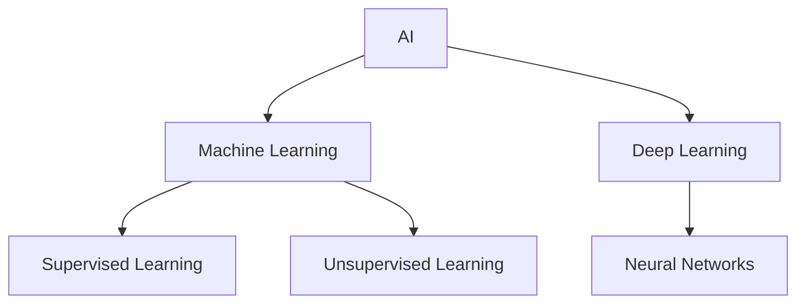

---

## Il dominio principale

Il repository ruota attorno a quattro macro-aree.

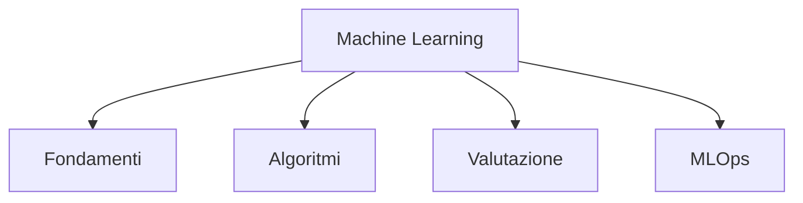

---

## Fondamenti

I fondamenti rappresentano la base teorica su cui si costruiscono tutti gli algoritmi successivi.

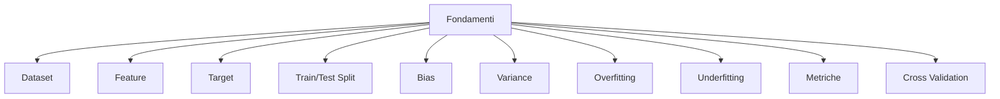

Capitolo:

- fondamenti-machine-learning.md

---

## Machine Learning supervisionato

Gli algoritmi supervisionati apprendono da dati etichettati.

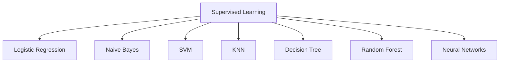

Tutti gli algoritmi presenti nel repository appartengono a questa categoria.

---

## Relazioni tra gli algoritmi

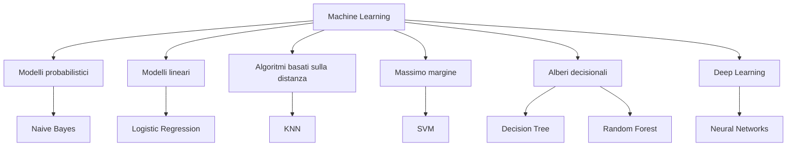

---

## Relazione tra preprocessing e algoritmi

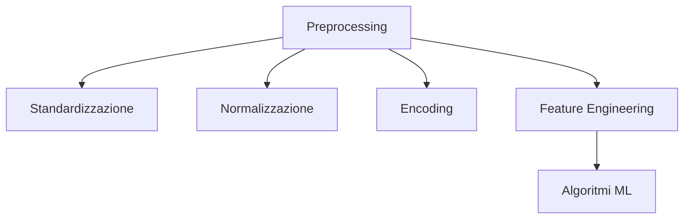

Non tutti gli algoritmi hanno le stesse esigenze.

| Algoritmo | Scaling consigliato |
|---|---|
| Logistic Regression | ✔ |
| SVM | ✔ |
| KNN | ✔ |
| Neural Networks | ✔ |
| Decision Tree | ✘ |
| Random Forest | ✘ |
| Naive Bayes | generalmente no |

---

## Collegamenti

Questa sezione si collega direttamente ai capitoli:

- fondamenti-machine-learning.md
- logistic-regression.md
- naive-bayes.md
- svm.md
- nearest-neighbors.md
- decision-tree-random-forest.md
- neural-networks.md

---

## Grafo delle dipendenze

Uno dei modi migliori per comprendere il Machine Learning consiste nell’osservare come ogni argomento costruisca le basi per il successivo.

Il seguente grafo rappresenta le principali dipendenze concettuali presenti nel repository.

---

## Dal dato al modello

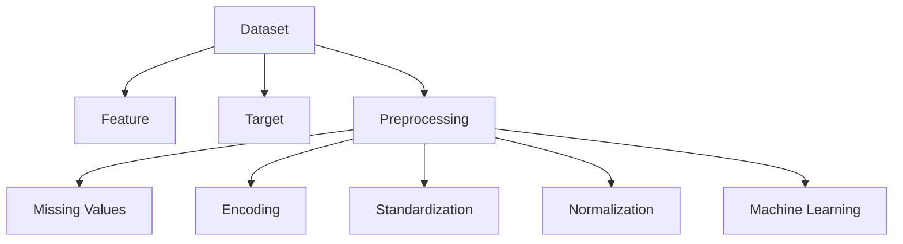

Prima di poter addestrare un modello è necessario preparare correttamente i dati.

Questa fase influenza direttamente le prestazioni di tutti gli algoritmi.

---

## Dalle probabilità a Naive Bayes

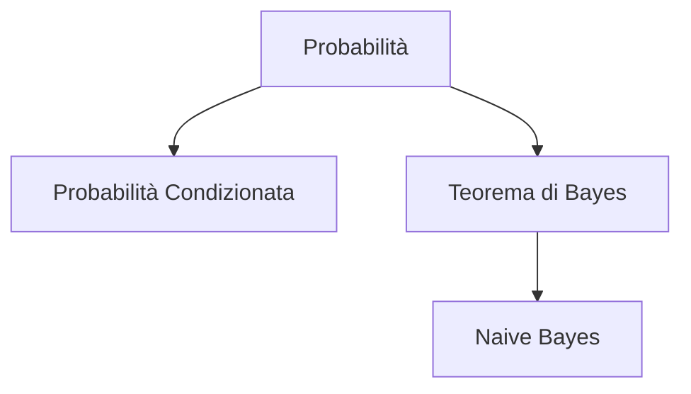

Dipendenze principali:

- probabilità;
- probabilità condizionata;
- prior;
- posterior;
- indipendenza condizionata.

Capitolo:

- naive-bayes.md

---

## Dal gradiente alle reti neurali

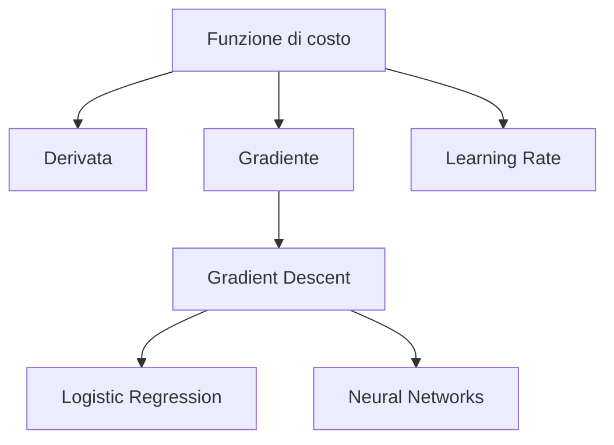

Il Gradient Descent rappresenta il collegamento naturale tra la Logistic Regression e le reti neurali.

Entrambi gli algoritmi apprendono aggiornando iterativamente i pesi.

---

## Evoluzione dei classificatori

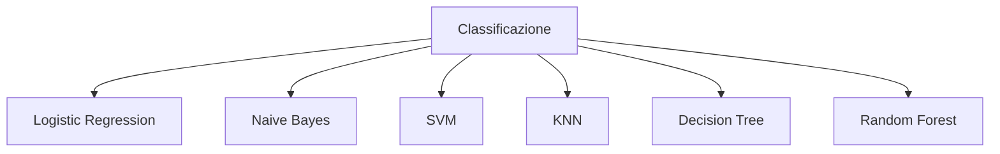

Ogni algoritmo affronta il problema della classificazione con una strategia differente:

| Algoritmo | Idea principale |
|---|---|
| Logistic Regression | modello lineare probabilistico |
| Naive Bayes | probabilità |
| SVM | margine massimo |
| KNN | vicini più prossimi |
| Decision Tree | regole decisionali |
| Random Forest | insieme di alberi |

---

## Alberi decisionali

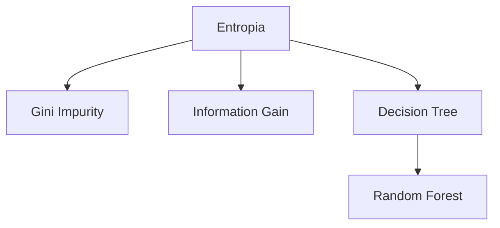

La Random Forest estende il Decision Tree combinando molti alberi addestrati su campioni differenti.

---

## Dipendenze delle reti neurali

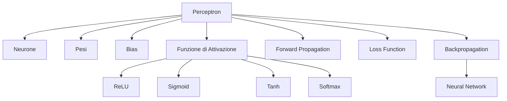

Le reti neurali rappresentano il punto di convergenza di numerosi concetti introdotti nei capitoli precedenti.

---

## Metriche di valutazione

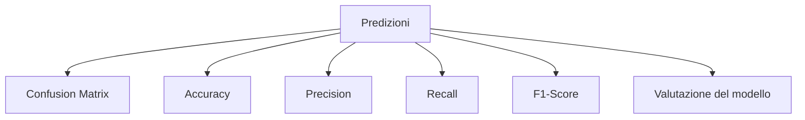

Le metriche vengono utilizzate indipendentemente dall’algoritmo scelto.

Sono quindi un livello trasversale dell’intero repository.

---

## Il ruolo di MLOps

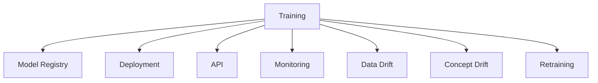

MLOps non introduce nuovi algoritmi di Machine Learning.

Il suo ruolo consiste nel gestire il ciclo di vita dei modelli una volta completato l’addestramento.

---

## Relazioni principali

Le dipendenze fondamentali del repository possono essere riassunte come segue:

| Concetto | Porta a |
|---|---|
| Probabilità | Naive Bayes |
| Gradient Descent | Logistic Regression, Neural Networks |
| Entropia | Decision Tree |
| Decision Tree | Random Forest |
| Distanza Euclidea | KNN |
| Margine | SVM |
| Metriche | Valutazione |
| Deployment | MLOps |

---

## Percorso di apprendimento consigliato

L’ordine dei capitoli del repository segue una progressione naturale:

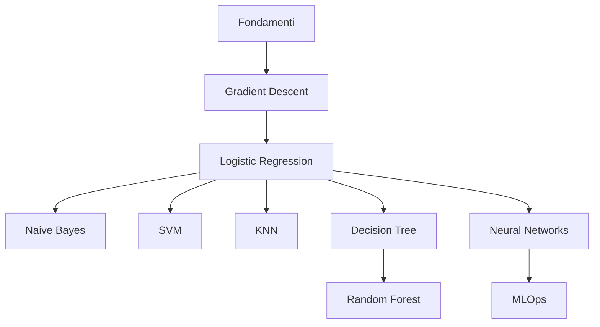

Questa sequenza permette di acquisire gradualmente le conoscenze necessarie, costruendo ogni nuovo argomento sulle basi di quelli precedenti.

---

## Grafo completo del repository

L'intero repository può essere rappresentato come una rete di conoscenze nella quale ogni capitolo dipende dai precedenti e costituisce la base per quelli successivi.

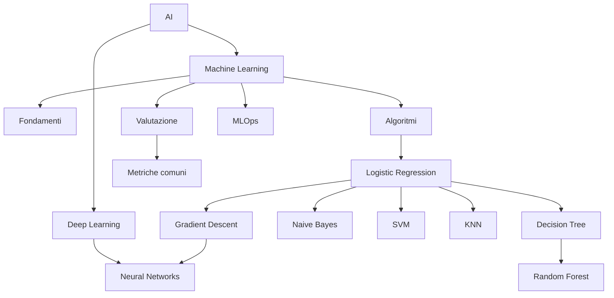

---

## Mappa delle dipendenze

La seguente tabella mostra le dipendenze principali tra i capitoli.

| Capitolo | Prerequisiti | Concetti acquisiti |
|----------|--------------|--------------------|
| Fondamenti | Nessuno | Dataset, Feature, Target, Metriche |
| Gradient Descent | Fondamenti | Ottimizzazione |
| Logistic Regression | Gradient Descent | Classificazione probabilistica |
| Naive Bayes | Probabilità | Classificazione probabilistica |
| SVM | Fondamenti | Margine massimo |
| KNN | Fondamenti | Algoritmi basati sulla distanza |
| Decision Tree | Entropia, Gini | Alberi decisionali |
| Random Forest | Decision Tree | Ensemble Learning |
| Neural Networks | Gradient Descent | Deep Learning |
| MLOps | Tutti gli algoritmi | Produzione e monitoraggio |

---

## Concetti condivisi

Molti concetti sono trasversali a più capitoli.

## Preprocessing

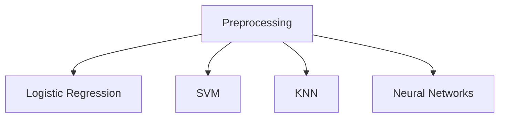

---

## Gradient Descent

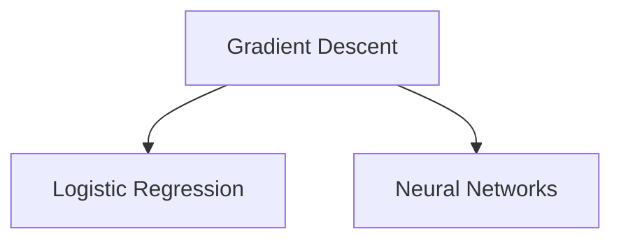

---

## Probabilità

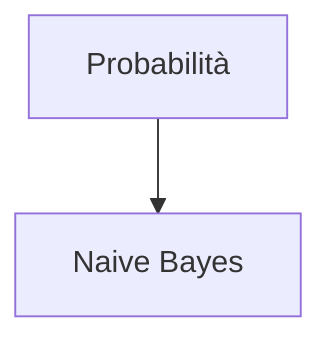

---

## Entropia

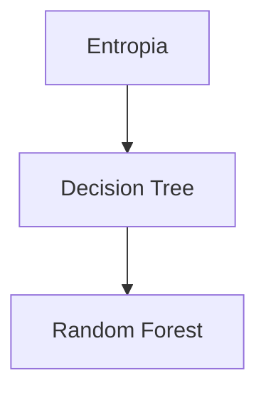

---

## Metriche

```mermaid
graph TD
      M[Metriche] --> LR[Logistic Regression]
      M --> NB[Naive Bayes]
      M --> SVM[SVM]
      M --> KNN[KNN]
      M --> DT[Decision Tree]
      M --> RF[Random Forest]
      M --> NN[Neural Networks]
```

Le metriche rappresentano uno degli elementi maggiormente condivisi tra tutti gli algoritmi studiati.

---

## Percorsi di studio consigliati

Il repository può essere affrontato seguendo percorsi differenti in funzione dell'obiettivo.

## Primo studio

```mermaid
flowchart TD
    F[Fondamenti] --> GD[Gradient Descent] --> LR[Logistic Regression] --> NB[Naive Bayes] --> SVM[SVM] --> KNN[KNN] --> DT[Decision Tree] --> RF[Random Forest] --> NN[Neural Networks] --> MLOps[MLOps]
```

---

## Ripasso rapido

```mermaid
flowchart TD
    F[Fondamenti] --> A[Algoritmi] --> M[Metriche] --> MLOps[MLOps]
```

---

## Preparazione all'esame

```mermaid
flowchart TD
    F[Fondamenti] --> FO[Formulario] --> G[Glossario] --> KG[Knowledge Graph] --> CA[Confronto algoritmi]
```

---

## Collegamenti con le appendici

Questo documento si integra con:

| Documento | Scopo |
|-----------|-------|
| formulario.md | Raccoglie tutte le formule |
| glossario.md | Definisce i principali termini |
| comparison.md | Confronta gli algoritmi |
| cheat-sheet.md | Ripasso rapido |
| exam-simulation.md | Simulazione dell'esame |

---

## Come utilizzare il Knowledge Graph

Questo documento può essere consultato in diversi momenti dello studio:

- all'inizio, per comprendere la struttura complessiva del corso;
- durante lo studio, per individuare le dipendenze tra gli argomenti;
- prima dell'esame, come mappa concettuale di ripasso;
- dopo il Master, come indice generale del repository.

L'obiettivo non è sostituire i singoli capitoli, ma mostrare come essi si collegano tra loro.

---

## Checklist finale

Al termine della lettura dovresti essere in grado di:

- comprendere la struttura dell'intero repository;
- identificare le dipendenze tra i capitoli;
- distinguere i concetti fondamentali da quelli avanzati;
- individuare rapidamente il capitolo in cui approfondire un argomento;
- scegliere un percorso di studio in funzione dell'obiettivo.

---

## Stato editoriale

**Stato:** FINAL 1.0

Il Knowledge Graph rappresenta la mappa concettuale dell'intero repository.

Il documento mostra le relazioni tra i principali argomenti del Master AI Engineering e costituisce il punto di collegamento tra i capitoli teorici e le appendici di supporto.

Eventuali aggiornamenti futuri riguarderanno esclusivamente:

- l'aggiunta di nuovi capitoli;
- l'inserimento di nuove relazioni tra i concetti;
- il miglioramento della rappresentazione grafica.
