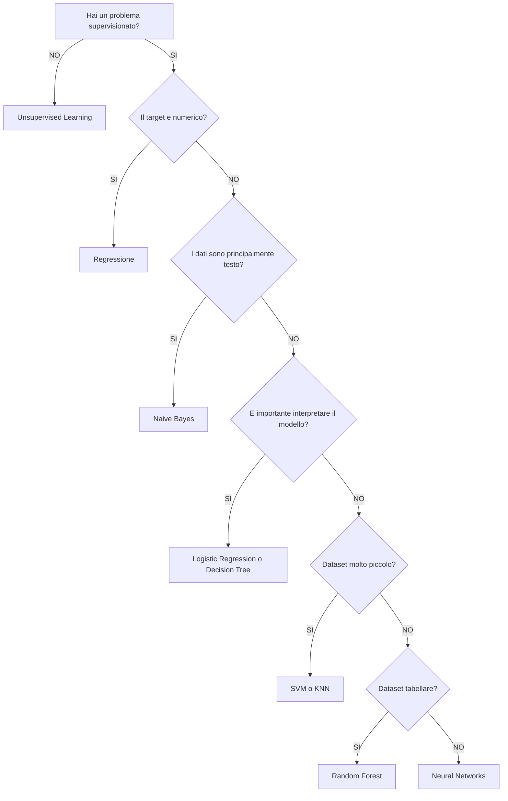

# Confronto tra gli algoritmi di Machine Learning

Appendice – Comparison Guide

---

## Obiettivo

Questo documento mette a confronto gli algoritmi studiati nel Master AI Engineering.

A differenza dei singoli capitoli, che descrivono il funzionamento di ciascun algoritmo, questa guida ha lo scopo di evidenziare:

- analogie;
- differenze;
- vantaggi;
- svantaggi;
- casi d’uso;
- criteri di scelta.

L’obiettivo finale è aiutare a rispondere alla domanda:

Quale algoritmo è più adatto al mio problema?

---

## Algoritmi considerati

Il confronto riguarda gli algoritmi trattati nel repository:

- Logistic Regression
- Naive Bayes
- Support Vector Machine
- K-Nearest Neighbors
- Decision Tree
- Random Forest
- Neural Networks

---

## Tabella comparativa generale

| Caratteristica | Logistic Regression | Naive Bayes | SVM | KNN | Decision Tree | Random Forest | Neural Networks |
|---|---|---|---|---|---|---|---|
| Tipo | Supervisato | Supervisato | Supervisato | Supervisato | Supervisato | Supervisato | Supervisato |
| Classificazione | ✔ | ✔ | ✔ | ✔ | ✔ | ✔ | ✔ |
| Regressione | ✘ | ✘ | ✔ (SVR) | ✔ | ✔ | ✔ | ✔ |
| Produce probabilità | ✔ | ✔ | opzionale | ✘ | ✔ | ✔ | ✔ |
| Richiede training | ✔ | ✔ | ✔ | quasi nullo | ✔ | ✔ | ✔ |
| Richiede scaling | ✔ | generalmente no | ✔ | ✔ | ✘ | ✘ | ✔ |
| Gestisce non linearità | limitatamente | limitatamente | ✔ | ✔ | ✔ | ✔ | ✔ |
| Interpretabile | molto | medio | basso | basso | molto | medio | basso |
| Robusto agli outlier | medio | medio | alto | basso | medio | alto | medio |
| Overfitting | medio | basso | medio | medio | alto | basso | alto |
| Tempo di training | basso | molto basso | elevato | quasi nullo | basso | medio | elevato |
| Tempo di inferenza | molto basso | molto basso | basso | elevato | basso | medio | basso |

---

## Categorie di algoritmi

Gli algoritmi possono essere raggruppati in base al principio su cui si basano.

| Categoria | Algoritmi |
|---|---|
| Modelli probabilistici | Naive Bayes |
| Modelli lineari | Logistic Regression |
| Massimo margine | SVM |
| Basati sulla distanza | KNN |
| Alberi decisionali | Decision Tree |
| Ensemble | Random Forest |
| Deep Learning | Neural Networks |

---

## Complessità concettuale

| Algoritmo | Difficoltà |
|---|---|
| Logistic Regression | ⭐⭐☆☆☆ |
| Naive Bayes | ⭐⭐☆☆☆ |
| Decision Tree | ⭐⭐☆☆☆ |
| KNN | ⭐⭐☆☆☆ |
| Random Forest | ⭐⭐⭐☆☆ |
| SVM | ⭐⭐⭐⭐☆ |
| Neural Networks | ⭐⭐⭐⭐⭐ |

---

## Interpretabilità

Uno degli aspetti più importanti nella scelta di un algoritmo riguarda la possibilità di comprenderne il funzionamento.

| Livello | Algoritmi |
|---|---|
| Molto elevata | Logistic Regression, Decision Tree |
| Elevata | Naive Bayes |
| Media | Random Forest |
| Bassa | SVM |
| Molto bassa | Neural Networks |

Quando è necessario spiegare le decisioni del modello (ad esempio in ambito sanitario o finanziario), algoritmi altamente interpretabili risultano generalmente preferibili.

---

## Dipendenze dal preprocessing

Non tutti gli algoritmi richiedono le stesse operazioni preliminari.

| Operazione | LR | NB | SVM | KNN | DT | RF | NN |
|---|---|---|---|---|---|---|---|
| Standardizzazione | ✔ | ✘ | ✔ | ✔ | ✘ | ✘ | ✔ |
| Normalizzazione | ✔ | ✘ | ✔ | ✔ | ✘ | ✘ | ✔ |
| Encoding | ✔ | ✔ | ✔ | ✔ | ✔ | ✔ | ✔ |
| Gestione valori mancanti | ✔ | ✔ | ✔ | ✔ | ✔ | ✔ | ✔ |

---

## Collegamenti

Per l’approfondimento dei singoli algoritmi si rimanda ai capitoli:

- logistic-regression.md
- naive-bayes.md
- svm.md
- nearest-neighbors.md
- decision-tree-random-forest.md
- neural-networks.md

---

## Confronti diretti tra gli algoritmi

Questa sezione mette a confronto gli algoritmi due a due, evidenziandone differenze, vantaggi, svantaggi e casi d’uso.

---

## Logistic Regression vs Naive Bayes

Entrambi sono classificatori supervisionati relativamente semplici e veloci, ma si basano su principi completamente differenti.

| Caratteristica | Logistic Regression | Naive Bayes |
|---|---|---|
| Modello | Lineare | Probabilistico |
| Produce probabilità | ✔ | ✔ |
| Ipotesi principali | Relazione lineare | Indipendenza delle feature |
| Training | Gradient Descent | Calcolo probabilistico |
| Interpretabilità | Molto elevata | Elevata |
| Richiede scaling | ✔ | Generalmente no |

Quando preferire Logistic Regression

- relazione quasi lineare;
- necessità di interpretare i coefficienti;
- feature numeriche ben scalate;
- classificazione binaria.

Quando preferire Naive Bayes

- classificazione testuale;
- spam detection;
- dataset piccoli;
- training molto veloce.

---

## Logistic Regression vs SVM

Entrambi costruiscono una frontiera di decisione, ma con approcci differenti.

| Caratteristica | Logistic Regression | SVM |
|---|---|---|
| Output naturale | Probabilità | Classe |
| Non linearità | Limitata | Elevata (Kernel) |
| Scaling | Necessario | Necessario |
| Interpretabilità | Alta | Bassa |
| Dataset piccoli | Buona | Ottima |
| Dataset molto grandi | Ottima | Più costosa |

Logistic Regression

Vantaggi:

- semplice;
- interpretabile;
- molto veloce.

SVM

Vantaggi:

- elevata accuratezza;
- ottima separazione;
- efficace anche con poche osservazioni.

---

## SVM vs KNN

Questi algoritmi sono spesso utilizzati sugli stessi problemi, ma hanno caratteristiche molto diverse.

| Caratteristica | SVM | KNN |
|---|---|---|
| Training | Costoso | Quasi nullo |
| Predizione | Rapida | Lenta |
| Scaling | Necessario | Necessario |
| Sensibilità al rumore | Bassa | Elevata |
| Parametri principali | C, Kernel | K |

Quando scegliere SVM

- dataset medio-piccoli;
- confini complessi;
- alta accuratezza.

Quando scegliere KNN

- implementazione molto semplice;
- dataset di piccole dimensioni;
- prototipazione rapida.

---

## Decision Tree vs Random Forest

La Random Forest nasce come evoluzione del Decision Tree.

| Caratteristica | Decision Tree | Random Forest |
|---|---|---|
| Interpretabilità | Molto alta | Media |
| Overfitting | Elevato | Ridotto |
| Robustezza | Media | Molto elevata |
| Velocità | Alta | Media |
| Accuratezza | Media | Generalmente superiore |

Decision Tree

Vantaggi:

- facilmente spiegabile;
- regole intuitive;
- ottimo per analisi esplorativa.

Random Forest

Vantaggi:

- maggiore accuratezza;
- migliore generalizzazione;
- robusta al rumore.

---

## Random Forest vs Neural Networks

Entrambi possono raggiungere prestazioni molto elevate, ma sono progettati per scenari differenti.

| Caratteristica | Random Forest | Neural Networks |
|---|---|---|
| Interpretabilità | Media | Molto bassa |
| Training | Medio | Elevato |
| Dati richiesti | Moderati | Molto numerosi |
| Feature Engineering | Importante | Meno critica |
| Prestazioni | Molto elevate | Eccellenti su problemi complessi |

Random Forest

Preferibile quando:

- dataset tabellari;
- numero limitato di osservazioni;
- necessità di robustezza.

Neural Networks

Preferibili quando:

- immagini;
- testo;
- audio;
- grandi quantità di dati.

---

## KNN vs Neural Networks

| Caratteristica | KNN | Neural Networks |
|---|---|---|
| Complessità | Molto bassa | Elevata |
| Training | Quasi nullo | Costoso |
| Inferenza | Lenta | Rapida |
| Dataset grandi | Poco adatto | Ottimo |
| Interpretabilità | Media | Bassa |

KNN è ideale come algoritmo di riferimento (baseline), mentre le reti neurali risultano più efficaci quando sono disponibili molti dati e adeguate risorse computazionali.

---

## Decision Tree vs Logistic Regression

| Caratteristica | Decision Tree | Logistic Regression |
|---|---|---|
| Relazioni non lineari | ✔ | Limitate |
| Interpretabilità | Molto alta | Molto alta |
| Scaling | Non necessario | Necessario |
| Overfitting | Più probabile | Minore |

La Logistic Regression è generalmente preferibile quando il problema è quasi lineare, mentre il Decision Tree è più adatto in presenza di regole decisionali non lineari.

---

## Neural Networks vs SVM

Entrambi possono modellare confini decisionali complessi.

| Caratteristica | Neural Networks | SVM |
|---|---|---|
| Dataset molto grandi | ✔ | Limitato |
| Dataset piccoli | Non ideale | ✔ |
| Deep Learning | ✔ | ✘ |
| Computer Vision | ✔ | Limitato |
| NLP | ✔ | Limitato |

Le SVM sono spesso una scelta eccellente per dataset di dimensioni contenute, mentre le reti neurali dominano nei problemi ad alta complessità e con grandi quantità di dati.

---

## Sintesi dei confronti

| Se il problema è… | Algoritmo consigliato |
|---|---|
| Lineare | Logistic Regression |
| Testuale | Naive Bayes |
| Dataset piccolo | SVM |
| Dataset tabellare | Random Forest |
| Immagini | Neural Networks |
| Prototipazione rapida | KNN |
| Interpretabilità | Decision Tree |
| Alta accuratezza su dati tabellari | Random Forest |

---

## Guida alla scelta dell’algoritmo

Non esiste un algoritmo universalmente migliore.

La scelta dipende dal problema, dal tipo di dati, dalla quantità di osservazioni disponibili e dai requisiti del progetto.

Le sezioni seguenti rappresentano una guida pratica alla selezione dell’algoritmo più adatto.

---

## Flowchart decisionale

---

## Scenari tipici

Spam Detection

Algoritmo consigliato

- Naive Bayes

Motivazione

- veloce;
- efficace sul testo;
- semplice da addestrare;
- ottimo baseline.

---

## Valutazione del rischio di credito

Algoritmo consigliato

- Logistic Regression

Motivazione

- interpretabile;
- restituisce probabilità;
- facilmente spiegabile.

---

## Classificazione di immagini

Algoritmo consigliato

- Neural Networks

Motivazione

- riconoscono pattern complessi;
- eccellenti prestazioni;
- supportano Deep Learning.

---

## Dataset tabellare aziendale

Algoritmo consigliato

- Random Forest

Motivazione

- alta accuratezza;
- robusta;
- pochi requisiti di preprocessing.

---

## Dataset molto piccolo

Algoritmo consigliato

- SVM

Motivazione

- ottima capacità di generalizzazione;
- efficace anche con pochi esempi.

---

## Sistema di raccomandazione semplice

Algoritmo consigliato

- KNN

Motivazione

- intuitivo;
- facile da implementare;
- buona baseline.

---

## Errori comuni nella scelta

Usare KNN su dataset enormi

Problema:

- inferenza molto lenta;
- elevato consumo di memoria.

Alternativa consigliata:

- Random Forest;
- Logistic Regression;
- Neural Networks.

---

## Utilizzare Decision Tree senza controllo

Problema:

- elevato rischio di overfitting.

Alternativa:

- Random Forest.

---

## Applicare SVM senza scaling

Problema:

la distanza tra i campioni risulta distorta e le prestazioni possono degradare sensibilmente.

---

## Utilizzare Neural Networks con pochi dati

Problema:

- rischio di overfitting;
- training instabile;
- generalizzazione limitata.

Alternative:

- Random Forest;
- SVM;
- Logistic Regression.

---

## Scegliere sempre l’algoritmo più complesso

Un modello più complesso non è necessariamente migliore.

In molti casi:

- Logistic Regression;
- Naive Bayes;
- Decision Tree

forniscono prestazioni paragonabili a modelli molto più sofisticati, con costi computazionali inferiori e maggiore interpretabilità.

---

## Tabella finale di scelta

| Situazione | Algoritmo consigliato |
|---|---|
| Testo | Naive Bayes |
| Dataset tabellare | Random Forest |
| Problema lineare | Logistic Regression |
| Interpretabilità elevata | Decision Tree |
| Pochi dati | SVM |
| Immagini | Neural Networks |
| Audio | Neural Networks |
| NLP moderno | Neural Networks |
| Baseline semplice | KNN |
| Produzione rapida | Logistic Regression |

---

## Considerazioni finali

La scelta dell’algoritmo rappresenta un compromesso tra:

- accuratezza;
- interpretabilità;
- costo computazionale;
- disponibilità dei dati;
- semplicità di implementazione;
- requisiti del progetto.

Nella pratica professionale è comune confrontare più modelli sullo stesso dataset prima di individuare la soluzione definitiva.

---

## Collegamenti

Questo documento completa le informazioni contenute nei capitoli:

- fondamenti-machine-learning.md
- logistic-regression.md
- naive-bayes.md
- svm.md
- nearest-neighbors.md
- decision-tree-random-forest.md
- neural-networks.md
- mlops.md

e si integra con le appendici:

- formulario.md
- glossario.md
- knowledge-graph.md

---

## Checklist finale

Al termine di questo documento dovresti essere in grado di:

- confrontare gli algoritmi studiati;
- identificare vantaggi e svantaggi di ciascun approccio;
- scegliere un algoritmo in funzione del problema;
- comprendere quando è necessario il preprocessing;
- riconoscere gli errori più comuni nella selezione di un modello;
- motivare la scelta di un algoritmo durante un esame o un colloquio tecnico.

---

## Stato editoriale

Stato: FINAL 1.0

Questo documento costituisce una guida comparativa agli algoritmi di Machine Learning trattati nel repository.

L’obiettivo non è descrivere il funzionamento dei singoli algoritmi, ma fornire criteri pratici per confrontarli e selezionare la soluzione più adatta in base al contesto applicativo.

Eventuali aggiornamenti futuri riguarderanno:

- l’aggiunta di nuovi algoritmi;
- l’integrazione con tecniche di Ensemble Learning avanzate;
- il confronto con modelli di Deep Learning più recenti.
