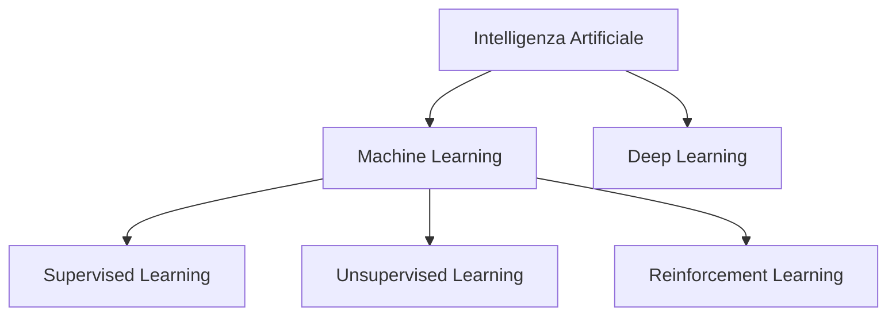
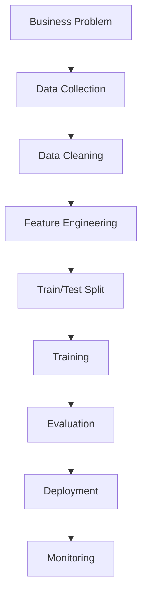

# Fondamenti di Machine Learning

Modulo: Fondamenti di Machine Learning

---

## Obiettivo del capitolo

Questo capitolo introduce i concetti fondamentali del Machine Learning e costituisce la base teorica per comprendere tutti gli algoritmi studiati nel Master.

Al termine dello studio dovresti essere in grado di:

- comprendere cosa sia il Machine Learning;
- distinguere AI, Machine Learning e Deep Learning;
- riconoscere le principali tipologie di apprendimento;
- comprendere il ciclo di vita di un progetto ML;
- interpretare correttamente dataset, feature e target;
- comprendere i concetti di overfitting, underfitting, bias e variance;
- conoscere le principali tecniche di validazione;
- comprendere le metriche fondamentali utilizzate nei modelli di Machine Learning.

---

## Cos’è il Machine Learning

Il Machine Learning (ML) è una disciplina dell’Intelligenza Artificiale che permette ai computer di apprendere automaticamente dai dati senza essere programmati esplicitamente mediante regole fisse.

L’idea fondamentale consiste nel costruire un modello capace di identificare schemi ricorrenti nei dati e utilizzare tali schemi per effettuare previsioni o prendere decisioni.

Invece di scrivere:

SE età > 18 ALLORA adulto

si forniscono esempi già etichettati e il modello apprende autonomamente la relazione tra gli input e l’output desiderato.

---

## Intelligenza Artificiale, Machine Learning e Deep Learning

Questi termini vengono spesso utilizzati come sinonimi, ma rappresentano concetti differenti.

- Artificial Intelligence (AI): disciplina generale che studia sistemi in grado di svolgere compiti normalmente associati all’intelligenza umana.
- Machine Learning (ML): sottoinsieme dell’AI basato sull’apprendimento dai dati.
- Deep Learning (DL): sottoinsieme del Machine Learning basato su reti neurali profonde.

Il Deep Learning rappresenta quindi una tecnica specifica di Machine Learning, mentre il Machine Learning è uno dei principali approcci dell’Intelligenza Artificiale.

---

## Quando utilizzare il Machine Learning

Il Machine Learning è particolarmente utile quando:

- non è possibile descrivere il problema mediante regole esplicite;
- i dati sono numerosi;
- il problema evolve nel tempo;
- è necessario effettuare previsioni.

Esempi:

- classificazione di email spam;
- riconoscimento immagini;
- diagnosi mediche;
- previsione del rischio di credito;
- sistemi di raccomandazione;
- rilevamento frodi.

---

## Tipologie di apprendimento

Le principali categorie di Machine Learning sono tre.

Supervised Learning

Nel Supervised Learning il modello viene addestrato utilizzando dati etichettati.

Ogni osservazione possiede:

- feature;
- target.

L’obiettivo consiste nell’apprendere una funzione che permetta di prevedere il target di nuovi esempi.

Algoritmi studiati nel Master:

- Logistic Regression;
- Naive Bayes;
- Support Vector Machine;
- Decision Tree;
- Random Forest;
- Neural Networks;
- K-Nearest Neighbors.

---

## Unsupervised Learning

Nel caso dell’Unsupervised Learning non esistono etichette.

Il modello deve individuare autonomamente strutture presenti nei dati.

Applicazioni tipiche:

- clustering;
- riduzione della dimensionalità;
- segmentazione clienti;
- anomaly detection.

---

## Reinforcement Learning

Nel Reinforcement Learning un agente interagisce con un ambiente.

Ad ogni azione riceve una ricompensa.

L’obiettivo consiste nel massimizzare la ricompensa cumulativa.

Applicazioni:

- robotica;
- videogiochi;
- controllo industriale;
- guida autonoma.

---

## Cenno al Self-Supervised Learning

Negli ultimi anni si è diffuso anche il Self-Supervised Learning, utilizzato soprattutto nei Large Language Model e nella Computer Vision.

In questo approccio le etichette vengono generate automaticamente a partire dai dati stessi, riducendo la necessità di annotazione manuale.

---

## Workflow di un progetto di Machine Learning

Un progetto ML segue generalmente queste fasi:

Questo workflow verrà ripreso e approfondito nel capitolo dedicato a MLOps.

---

## Dataset, Feature e Target

Ogni progetto di Machine Learning parte da un dataset, ovvero una raccolta organizzata di dati utilizzata per addestrare e valutare un modello.

Un dataset è composto da osservazioni (righe) e variabili (colonne).

Campione (Sample)

Ogni riga del dataset rappresenta un campione o osservazione.

Ad esempio, in un dataset di clienti, ogni riga può rappresentare una persona.

Feature

Le feature (o variabili indipendenti) descrivono le caratteristiche dei campioni.

Esempi:

- età;
- reddito;
- peso;
- numero di acquisti;
- temperatura.

Le feature costituiscono l’input del modello.

Target (Label)

Il target rappresenta il valore che il modello deve imparare a prevedere.

Può essere:

- una classe (problema di classificazione);
- un valore numerico (problema di regressione).

Esempio:

| Età | Reddito | Acquista? |
|---|---|---|
| 25 | 25.000 € | No |
| 42 | 58.000 € | Sì |

In questo caso:

- Feature → Età, Reddito
- Target → Acquista?

---

## Classificazione e Regressione

I problemi di Machine Learning supervisionato si dividono principalmente in due categorie.

Classificazione

L’obiettivo è prevedere una categoria.

Esempi:

- spam / non spam;
- malato / sano;
- cliente acquisterà / non acquisterà.

Algoritmi studiati:

- Logistic Regression;
- Naive Bayes;
- SVM;
- Decision Tree;
- Random Forest;
- KNN;
- Neural Networks.

Regressione

L’obiettivo è prevedere un valore continuo.

Esempi:

- prezzo di una casa;
- temperatura;
- fatturato;
- consumo energetico.

---

## Train, Validation e Test Set

Per valutare correttamente un modello è necessario suddividere il dataset.

Training Set

Utilizzato per addestrare il modello.

È il sottoinsieme da cui l’algoritmo apprende.

Validation Set

Utilizzato per:

- scegliere gli iperparametri;
- confrontare modelli;
- prevenire l’overfitting.

Test Set

Serve esclusivamente per valutare le prestazioni finali del modello.

Non deve essere utilizzato durante l’addestramento.

Una suddivisione tipica è:

| Dataset | Percentuale |
|---|---|
| Training | 70% |
| Validation | 15% |
| Test | 15% |

In alternativa è comune utilizzare una suddivisione 80/20 insieme alla Cross Validation.

---

## Generalizzazione

L’obiettivo di un modello non è memorizzare il training set.

Un buon modello deve essere in grado di generalizzare, cioè produrre buone previsioni anche su dati mai osservati.

La generalizzazione rappresenta uno degli obiettivi principali del Machine Learning.

---

## Overfitting

L’overfitting si verifica quando il modello apprende troppo bene il training set, compresi rumore e anomalie.

Caratteristiche:

- accuracy molto elevata sul training set;
- prestazioni peggiori sul test set.

Cause frequenti:

- modello troppo complesso;
- dataset troppo piccolo;
- assenza di regolarizzazione.

Possibili soluzioni:

- raccogliere più dati;
- semplificare il modello;
- utilizzare tecniche di regolarizzazione;
- applicare la Cross Validation.

---

## Underfitting

L’underfitting si verifica quando il modello è troppo semplice per rappresentare il problema.

Sintomi:

- errori elevati sia sul training sia sul test set.

Possibili cause:

- poche feature;
- modello troppo semplice;
- addestramento insufficiente.

---

## Bias e Variance

Bias

Il bias misura quanto il modello sia lontano dalla funzione reale.

Bias elevato implica modelli troppo semplici e underfitting.

Variance

La variance misura quanto il modello sia sensibile alle variazioni del training set.

Variance elevata implica modelli complessi e overfitting.

Bias–Variance Tradeoff

Uno dei principali obiettivi del Machine Learning consiste nel trovare un equilibrio tra bias e variance.

Un modello efficace mantiene entrambi a livelli contenuti, ottenendo una buona capacità di generalizzazione.

---

## Feature Engineering

La qualità delle feature è spesso più importante della complessità dell’algoritmo utilizzato.

Per Feature Engineering si intende il processo di creazione, trasformazione e selezione delle variabili che verranno utilizzate dal modello.

L’obiettivo è fornire al modello informazioni più significative, migliorando la capacità di apprendimento.

Esempi di Feature Engineering:

- trasformare una data nelle componenti giorno, mese e anno;
- estrarre il dominio da un indirizzo email;
- creare il rapporto tra due variabili;
- codificare variabili categoriche tramite One-Hot Encoding;
- eliminare feature ridondanti.

Una buona attività di Feature Engineering può migliorare sensibilmente le prestazioni del modello.

---

## Feature Scaling

Molti algoritmi di Machine Learning sono influenzati dalla scala delle feature.

Ad esempio:

- Logistic Regression;
- Support Vector Machine;
- K-Nearest Neighbors;
- Neural Networks.

Se una feature assume valori compresi tra 0 e 1 e un’altra tra 0 e 100.000, quest’ultima potrebbe dominare il processo di apprendimento.

Le tecniche più comuni sono:

Standardization

Trasforma ogni feature in modo che abbia:

- media uguale a 0;
- deviazione standard uguale a 1.

È il metodo più utilizzato.

Min-Max Scaling

Trasforma ogni feature nell’intervallo:

[0,1]

È spesso utilizzato nelle reti neurali.

Gli alberi decisionali e le Random Forest, invece, non richiedono generalmente lo scaling delle feature.

---

## Train/Test Split e Cross Validation

Una semplice suddivisione Train/Test potrebbe produrre risultati influenzati dal caso.

Per ottenere una valutazione più robusta si utilizza la Cross Validation.

K-Fold Cross Validation

Il dataset viene suddiviso in K parti.

Per ogni iterazione:

- una parte viene utilizzata come validation set;
- le altre come training set.

Il processo viene ripetuto K volte.

Infine si calcola la media delle metriche ottenute.

Una scelta molto comune è:

K = 5

oppure

K = 10

La Cross Validation permette di stimare meglio la capacità di generalizzazione del modello.

---

## Metriche principali

La scelta della metrica dipende dal tipo di problema.

Classificazione

Le metriche più comuni sono:

- Accuracy;
- Precision;
- Recall;
- F1-Score;
- ROC Curve;
- AUC;
- Confusion Matrix.

Regressione

Le metriche principali sono:

- Mean Absolute Error (MAE);
- Mean Squared Error (MSE);
- Root Mean Squared Error (RMSE);
- R² Score.

Ogni algoritmo studiato nei capitoli successivi utilizzerà una o più di queste metriche.

---

## Errori comuni

Valutare il modello solo sul Training Set

Un modello deve essere valutato su dati mai osservati durante l’addestramento.

Utilizzare il Test Set durante il tuning

Il Test Set deve essere utilizzato una sola volta, al termine dello sviluppo.

Sottovalutare il preprocessing

La qualità dei dati influisce direttamente sulle prestazioni del modello.

Pulizia, trasformazione e normalizzazione sono spesso determinanti.

Utilizzare solo l’Accuracy

Su dataset sbilanciati è preferibile considerare anche Precision, Recall e F1-Score.

Ignorare l’Overfitting

Prestazioni molto elevate sul training set non garantiscono un buon comportamento su nuovi dati.

---

## Quiz di ripasso

Domanda 1

Qual è la differenza tra Machine Learning e Deep Learning?

Risposta: il Deep Learning è un sottoinsieme del Machine Learning basato su reti neurali profonde.

Domanda 2

Che differenza c’è tra classificazione e regressione?

Risposta: la classificazione prevede categorie, mentre la regressione prevede valori continui.

Domanda 3

Perché si utilizza il Validation Set?

Risposta: per scegliere gli iperparametri e confrontare i modelli senza utilizzare il Test Set.

Domanda 4

Che cos’è l’overfitting?

Risposta: la capacità del modello di adattarsi eccessivamente al training set, perdendo capacità di generalizzazione.

Domanda 5

Qual è lo scopo della Cross Validation?

Risposta: ottenere una stima più affidabile delle prestazioni del modello.

---

## Deeptest

Domanda 1

Quale tipologia di apprendimento utilizza dati etichettati?

- A. Reinforcement Learning
- B. Unsupervised Learning
- C. Supervised Learning
- D. Self-Supervised Learning

Risposta corretta: C.

Domanda 2

Quale insieme di dati deve rimanere inutilizzato fino alla valutazione finale?

- A. Training Set
- B. Validation Set
- C. Test Set
- D. Feature Set

Risposta corretta: C.

Domanda 3

Quale problema indica un modello troppo complesso?

- A. Underfitting
- B. Overfitting
- C. Data Leakage
- D. Rumore

Risposta corretta: B.

Domanda 4

Quale algoritmo, tra quelli studiati, normalmente non richiede feature scaling?

- A. Logistic Regression
- B. SVM
- C. KNN
- D. Decision Tree

Risposta corretta: D.

Domanda 5

Che cosa misura la variance?

- A. La complessità del dataset
- B. La sensibilità del modello ai dati di training
- C. Il numero di feature
- D. La probabilità di errore

Risposta corretta: B.

---

## Checklist finale di padronanza

Al termine di questo capitolo dovresti essere in grado di spiegare:

- differenza tra AI, Machine Learning e Deep Learning;
- principali tipologie di apprendimento;
- struttura di un dataset;
- differenza tra feature e target;
- differenza tra classificazione e regressione;
- train, validation e test set;
- generalizzazione;
- overfitting e underfitting;
- bias e variance;
- feature engineering;
- feature scaling;
- cross validation;
- principali metriche di valutazione.

---

## Collegamenti consigliati

Questo capitolo costituisce la base teorica per tutti gli altri:

- Gradient Descent;
- Logistic Regression;
- Naive Bayes;
- SVM;
- Nearest Neighbors;
- Neural Networks;
- Decision Tree & Random Forest;
- MLOps.

---

## Stato del recupero

| Area | Stato |
|---|---|
| Introduzione | ✅ |
| Tipologie di apprendimento | ✅ |
| Workflow ML | ✅ |
| Dataset | ✅ |
| Classificazione e regressione | ✅ |
| Train / Validation / Test | ✅ |
| Generalizzazione | ✅ |
| Overfitting e Underfitting | ✅ |
| Bias e Variance | ✅ |
| Feature Engineering | ✅ |
| Feature Scaling | ✅ |
| Cross Validation | ✅ |
| Metriche | ✅ |
| Errori comuni | ✅ |
| Quiz | ✅ |
| Deeptest | ✅ |
| Checklist finale | ✅ |

Recovery score stimato: 99%

---

## Stato editoriale

Stato: FINAL 1.0

Il capitolo è considerato completo in prima versione definitiva.

Eventuali aggiornamenti futuri dovranno limitarsi a:

- integrazioni provenienti dal materiale originale del Master;
- uniformazione stilistica con il resto del repository;
- correzione di eventuali refusi.
