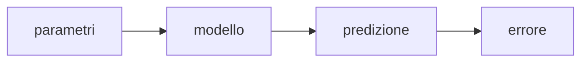

# Gradient Descent

> Modulo: Machine Learning – Modelli e Algoritmi

---

## Obiettivo del capitolo

Il Gradient Descent è il principale algoritmo di ottimizzazione utilizzato nel Machine Learning. Quasi tutti i modelli parametrici studiati nel Master — dalla regressione lineare alle reti neurali profonde — utilizzano, direttamente o indirettamente, una variante del Gradient Descent per apprendere i propri parametri.

Comprendere questo algoritmo significa comprendere il meccanismo con cui un modello "impara".

---

## Concetti chiave

- funzione di costo
- derivata
- derivate parziali
- gradiente
- learning rate
- convergenza
- epoche
- batch
- ottimizzazione iterativa

---

## Perché serve un algoritmo di ottimizzazione?

Supponiamo di voler costruire un modello capace di prevedere il prezzo di una casa.

All'inizio il modello non conosce nulla.

I pesi sono casuali.

Le predizioni sono quindi molto lontane dalla realtà.

L'obiettivo dell'addestramento consiste nel modificare progressivamente tali parametri fino a ridurre l'errore.

Il Gradient Descent è proprio il procedimento che permette questo miglioramento iterativo.

---

## La funzione di costo

Ogni modello supervisionato produce un errore.

Occorre quindi una funzione capace di misurare quanto il modello stia sbagliando.

Questa funzione prende il nome di **funzione di costo** (Cost Function o Loss Function).

Formalmente:



L'intero addestramento consiste nel minimizzare questa funzione.

Maggiore è il costo:

- peggiori sono le predizioni.

Minore è il costo:

- migliore è il modello.

---

## Un'intuizione geometrica

Immaginiamo una montagna.

Noi ci troviamo in un punto qualsiasi.

L'obiettivo è raggiungere la valle.

Non conosciamo la mappa.

Possiamo però osservare la pendenza locale.

La direzione di massima salita è data dal gradiente.

Per scendere verso la valle basta muoversi nella direzione opposta.

Questa è esattamente l'idea del Gradient Descent.

---

## Le derivate

Per capire il Gradient Descent bisogna comprendere il significato della derivata.

Una derivata misura la variazione di una funzione rispetto ad una variabile.

Interpretazione pratica:

- derivata positiva → la funzione cresce;
- derivata negativa → la funzione diminuisce;
- derivata nulla → punto stazionario.

Nel corso questo concetto viene introdotto mediante l'esempio della velocità.

Se la posizione è una funzione del tempo:

```text
s(t)
```

allora

```text
ds/dt
```

rappresenta la velocità istantanea.

La derivata descrive quindi **quanto rapidamente cambia una grandezza**.

---

## Derivate parziali

Nei modelli di Machine Learning la funzione di costo dipende da molti parametri.

Ad esempio:

```text
J(w₁,w₂,w₃,...,b)
```

Non è quindi sufficiente una singola derivata.

Occorre calcolare una derivata rispetto ad ogni parametro.

Queste prendono il nome di **derivate parziali**.

Ogni derivata parziale indica come cambia la funzione modificando un solo parametro e mantenendo costanti tutti gli altri.

---

## Il gradiente

Il gradiente è il vettore formato da tutte le derivate parziali.

Formalmente:

```text
∇J =
(
∂J/∂w₁,
∂J/∂w₂,
...
∂J/∂b
)
```

Il gradiente possiede due proprietà fondamentali:

1. indica la direzione di massima crescita della funzione;

2. la sua norma misura quanto rapidamente la funzione cresce.

Per minimizzare la funzione bisogna quindi muoversi nella direzione opposta al gradiente.

Da qui deriva il nome:

**Gradient Descent**

ovvero

> discesa lungo il gradiente.

---

## Aggiornamento dei parametri

L'aggiornamento dei pesi segue sempre la stessa regola.

```text
nuovo parametro =
vecchio parametro
−
learning rate × gradiente
```

Oppure, nella forma classica:

```text
θ = θ − α ∇J(θ)
```

dove:

- θ rappresenta il vettore dei parametri;
- α rappresenta il learning rate;
- ∇J è il gradiente della funzione di costo.

Questa formula costituisce il cuore dell'intero algoritmo.

Ogni iterazione produce un modello leggermente migliore rispetto alla precedente.

---

## Learning Rate

Il learning rate determina l'ampiezza del passo effettuato ad ogni iterazione.

È uno degli iperparametri più importanti del Machine Learning.

## Learning rate troppo piccolo

Se α è molto piccolo:

- apprendimento estremamente lento;
- molte epoche necessarie;
- tempi di addestramento elevati.

Il modello converge, ma impiega molto tempo.

## Learning rate troppo grande

Se α è troppo elevato:

- il minimo viene continuamente superato;
- il costo oscilla;
- l'algoritmo può divergere.

In questo caso il modello non apprende.

---

## La convergenza

L'algoritmo termina quando il gradiente diventa sufficientemente piccolo oppure quando il miglioramento della funzione di costo diventa trascurabile.

In pratica:

- il modello continua ad aggiornare i pesi;
- la funzione di costo diminuisce;
- gli aggiornamenti diventano sempre più piccoli;
- il modello converge.

La convergenza non garantisce necessariamente il minimo globale.

Garantisce però il raggiungimento di un punto stabile della funzione di costo.

---

## Varianti del Gradient Descent

Nel corso sono state presentate tre principali varianti del Gradient Descent. La differenza tra esse riguarda il numero di esempi utilizzati per calcolare il gradiente ad ogni aggiornamento dei parametri.

## Batch Gradient Descent

Nel **Batch Gradient Descent** ogni aggiornamento viene calcolato utilizzando **l'intero dataset di addestramento**.

In altre parole, prima di modificare i parametri il modello osserva tutti gli esempi disponibili, calcola il gradiente complessivo e solo successivamente aggiorna i pesi.

### Vantaggi

- traiettoria di apprendimento stabile;
- stima accurata del gradiente;
- convergenza generalmente regolare.

### Svantaggi

- costo computazionale elevato;
- tempi di aggiornamento lunghi;
- poco adatto a dataset molto grandi.

Per dataset di grandi dimensioni questa variante diventa rapidamente impraticabile, poiché ogni aggiornamento richiede una scansione completa dei dati.

---

## Stochastic Gradient Descent (SGD)

Lo **Stochastic Gradient Descent (SGD)** aggiorna i parametri utilizzando **un solo campione** alla volta.

Per ogni esempio del dataset viene calcolato il gradiente e viene immediatamente effettuato un aggiornamento dei pesi.

### Vantaggi

- aggiornamenti molto rapidi;
- elevata scalabilità;
- adatto a dataset molto grandi;
- il rumore introdotto dagli aggiornamenti può aiutare ad uscire da minimi locali.

### Svantaggi

- traiettoria di apprendimento molto rumorosa;
- oscillazioni della funzione di costo;
- convergenza meno stabile rispetto al Batch Gradient Descent.

Il grafico della funzione di costo durante l'addestramento presenta tipicamente continue oscillazioni, anche se la tendenza generale rimane decrescente.

---

## Mini-Batch Gradient Descent

Il **Mini-Batch Gradient Descent** rappresenta un compromesso tra le due varianti precedenti.

Ad ogni aggiornamento vengono utilizzati piccoli gruppi di esempi, detti **mini-batch**.

Valori tipici della dimensione del batch sono:

- 16
- 32
- 64
- 128
- 256
- 512

Questa è la variante maggiormente utilizzata nelle librerie moderne di Deep Learning.

### Vantaggi

- maggiore stabilità rispetto allo SGD;
- aggiornamenti molto più rapidi del Batch Gradient Descent;
- utilizzo efficiente della memoria;
- ottima parallelizzazione su GPU.

Per questi motivi TensorFlow, PyTorch e la maggior parte dei framework moderni lavorano normalmente con mini-batch.

---

## Confronto tra le varianti

| Variante | Campioni per aggiornamento | Velocità | Stabilità | Uso pratico |
|-----------|---------------------------:|:--------:|:---------:|:-----------:|
| Batch | Tutto il dataset | Bassa | Molto alta | Limitato |
| SGD | 1 | Molto alta | Bassa | Dataset molto grandi |
| Mini-Batch | Piccolo gruppo | Alta | Alta | Standard attuale |

---

## Epoche, Batch e Iterazioni

Uno degli aspetti che crea maggiore confusione durante lo studio riguarda la distinzione tra **sample**, **batch**, **iteration** ed **epoch**.

## Sample

Un **sample** è un singolo esempio del dataset.

Ad esempio, se il dataset contiene 10.000 osservazioni, allora sono presenti 10.000 sample.

---

## Batch

Un **batch** è un gruppo di sample elaborati contemporaneamente.

Se scegliamo:

```text
batch size = 100
```

ogni aggiornamento utilizzerà 100 esempi.

---

## Iteration

Un'**iterazione** corrisponde ad un singolo aggiornamento dei parametri.

Ogni volta che viene calcolato il gradiente e vengono aggiornati i pesi si completa un'iterazione.

---

## Epoch

Un'**epoca** rappresenta un passaggio completo attraverso l'intero dataset.

Se il dataset contiene:

```text
10.000 esempi
```

e scegliamo

```text
batch size = 100
```

allora saranno necessarie:

```text
10.000 / 100 = 100 iterazioni
```

per completare una singola epoca.

In generale:

```text
1 epoca = tutte le iterazioni necessarie per elaborare l'intero dataset una volta.
```

---

## Online Learning

L'**Online Learning** permette di continuare l'apprendimento di un modello già addestrato senza ricominciare il training da zero.

L'idea consiste nell'aggiornare periodicamente i parametri quando diventano disponibili nuovi dati.

Questo approccio è particolarmente utile quando:

- arrivano continuamente nuovi esempi;
- il fenomeno osservato cambia nel tempo;
- il riaddestramento completo sarebbe troppo costoso.

## Esempio: compagnia assicurativa

Durante il corso è stato proposto l'esempio di una compagnia assicurativa.

Il modello viene addestrato sui dati disponibili.

Successivamente arrivano nuovi clienti e nuove richieste di risarcimento.

Invece di ripartire da zero, il modello può essere aggiornato utilizzando questi nuovi dati, migliorando progressivamente la qualità delle previsioni.

## Esempio: modelli generativi

Lo stesso principio viene utilizzato anche nei moderni modelli generativi.

I feedback degli utenti possono essere utilizzati per effettuare ulteriori fasi di addestramento, migliorando progressivamente il comportamento del modello senza ricostruirlo completamente.

---

## Implementazione semplificata

Di seguito è riportato uno schema estremamente semplificato del funzionamento del Gradient Descent.

```python
weights = initialize()

for epoch in range(epochs):

    gradient = compute_gradient(weights)

    weights = weights - learning_rate * gradient
```

Nella pratica queste operazioni vengono eseguite automaticamente da librerie come **scikit-learn**, **TensorFlow** e **PyTorch**, che implementano algoritmi di ottimizzazione altamente ottimizzati e in grado di sfruttare CPU multicore e GPU.

---

## Esempio numerico

Per comprendere il funzionamento del Gradient Descent consideriamo un esempio molto semplice.

Supponiamo che la funzione di costo sia:

```text
J(w) = (w - 3)²
```

Il minimo della funzione si trova chiaramente nel punto:

```text
w = 3
```

Immaginiamo però di non conoscere questa informazione.

Partiamo da un valore iniziale:

```text
w = 8
```

e scegliamo:

```text
learning rate = 0.2
```

La derivata della funzione è:

```text
J'(w) = 2(w - 3)
```

## Prima iterazione

```text
w = 8
```

Gradiente:

```text
2(8 - 3) = 10
```

Aggiornamento:

```text
w = 8 - 0.2 × 10

w = 6
```

Il parametro si è già avvicinato al minimo.

---

## Seconda iterazione

Nuovo gradiente:

```text
2(6 - 3) = 6
```

Aggiornamento:

```text
w = 6 - 0.2 × 6

w = 4.8
```

---

## Terza iterazione

Gradiente:

```text
2(4.8 - 3) = 3.6
```

Aggiornamento:

```text
w = 4.8 - 0.2 × 3.6

w = 4.08
```

Si osserva che:

- il parametro continua ad avvicinarsi al minimo;
- il gradiente diminuisce progressivamente;
- gli spostamenti diventano sempre più piccoli.

Questo è il comportamento tipico del Gradient Descent.

---

## Collegamento con gli algoritmi del Master

Uno degli aspetti più importanti del corso è comprendere che il Gradient Descent **non è un algoritmo di Machine Learning autonomo**, ma un algoritmo di ottimizzazione utilizzato da moltissimi modelli.

Nel percorso del Master ricompare in numerosi moduli.

## Regressione Lineare

Nella regressione lineare il Gradient Descent viene utilizzato per trovare i coefficienti della retta che minimizzano la funzione di costo.

L'obiettivo è ottenere la migliore approssimazione possibile dei dati osservati.

---

## Regressione Logistica

Anche la regressione logistica utilizza il Gradient Descent.

La differenza principale riguarda la funzione di costo, che non è più l'errore quadratico medio ma la **Log Loss (Cross Entropy)**.

Il meccanismo di aggiornamento dei pesi rimane invece lo stesso.

---

## Reti Neurali

Nelle reti neurali il Gradient Descent rappresenta il cuore dell'apprendimento.

Il gradiente viene calcolato tramite l'algoritmo di **Backpropagation**, che propaga l'errore dall'output verso gli strati precedenti della rete.

Ogni peso viene aggiornato secondo la stessa regola vista in questo capitolo.

Senza Gradient Descent una rete neurale non sarebbe in grado di apprendere.

---

## Errori comuni

Durante lo studio del Gradient Descent emergono spesso alcuni errori concettuali.

## Confondere il gradiente con la derivata

La derivata riguarda una funzione rispetto ad una sola variabile.

Il gradiente è invece un vettore composto da tutte le derivate parziali.

---

## Pensare che il Gradient Descent trovi sempre il minimo globale

Non è vero.

Su funzioni complesse il Gradient Descent può convergere ad un minimo locale oppure ad un punto di sella.

Per questo motivo inizializzazioni differenti possono portare a risultati diversi.

---

## Credere che un learning rate più alto sia sempre migliore

Un learning rate eccessivamente elevato può impedire completamente la convergenza.

In molti casi è preferibile un valore più piccolo oppure un learning rate adattivo.

---

## Dimenticare la normalizzazione delle feature

Quando le feature hanno scale molto differenti, il Gradient Descent può convergere molto lentamente.

Per questo motivo è spesso consigliato applicare tecniche di normalizzazione o standardizzazione prima dell'addestramento.

---

---

## Troubleshooting del Gradient Descent

Durante l'addestramento è possibile osservare alcuni comportamenti tipici della funzione di costo. La tabella seguente aiuta a identificarne le cause più probabili.

| Comportamento osservato | Possibile causa | Possibile soluzione |
|--------------------------|-----------------|---------------------|
| La loss oscilla continuamente | Learning rate troppo elevato | Ridurre il learning rate |
| La loss diminuisce molto lentamente | Learning rate troppo basso | Aumentare moderatamente il learning rate |
| La loss aumenta progressivamente | Learning rate eccessivo oppure errore nell'implementazione | Verificare learning rate e formula di aggiornamento |
| La loss si blocca presto | Minimo locale, punto di sella oppure modello poco espressivo | Modificare inizializzazione, ottimizzatore o modello |
| Convergenza molto lenta | Feature su scale molto diverse | Applicare Standardization o Normalization |
| Training instabile | Batch troppo piccolo o dati rumorosi | Aumentare il batch size oppure usare Mini-Batch Gradient Descent |

---

## Consigli pratici

Nella maggior parte dei progetti reali è buona norma:

- standardizzare le feature prima dell'addestramento;
- partire con un learning rate moderato;
- monitorare sempre la loss durante il training;
- confrontare più valori del learning rate;
- utilizzare Mini-Batch Gradient Descent come scelta predefinita;
- preferire ottimizzatori adattivi (come Adam) nelle reti neurali profonde.

---

## Da ricordare per l'esame

I concetti fondamentali da ricordare sono:

- il Gradient Descent minimizza una funzione di costo;
- utilizza il gradiente per determinare la direzione di aggiornamento;
- aggiorna i parametri nella direzione opposta al gradiente;
- il learning rate controlla l'ampiezza del passo;
- Batch, SGD e Mini-Batch differiscono per il numero di campioni utilizzati ad ogni aggiornamento;
- il Mini-Batch Gradient Descent è la variante maggiormente utilizzata nelle librerie moderne;
- il Gradient Descent è alla base della regressione lineare, della regressione logistica e dell'addestramento delle reti neurali.

---

## Insight maturati durante il Master

Nel corso del Master il Gradient Descent è emerso come il filo conduttore di molti algoritmi apparentemente diversi.

All'inizio viene presentato come un semplice algoritmo di ottimizzazione, ma proseguendo con il percorso diventa evidente che rappresenta il meccanismo attraverso cui un modello "impara" dai dati.

Comprendere bene questo capitolo rende molto più semplice affrontare argomenti successivi come la regressione logistica, le reti neurali, il backpropagation e gli ottimizzatori avanzati (Adam, RMSProp, AdaGrad), che estendono lo stesso principio introducendo strategie di aggiornamento più sofisticate.

---

## Riepilogo

Il Gradient Descent è un algoritmo iterativo che consente di minimizzare una funzione di costo aggiornando progressivamente i parametri del modello.

L'intero processo si basa su tre elementi fondamentali:

1. calcolo del gradiente;
2. scelta del learning rate;
3. aggiornamento iterativo dei parametri.

Questi concetti costituiscono una delle basi teoriche più importanti dell'intero Master in Machine Learning.

---

## Codice Python dell'esercitazione

Questa sezione raccoglie la parte più operativa del capitolo. L'obiettivo non è sostituire le implementazioni delle librerie, ma rendere esplicito il meccanismo che normalmente viene nascosto dietro metodi come `fit()`.

Nel Master il punto fondamentale era comprendere che l'addestramento non è magia: è un ciclo iterativo in cui il modello produce una predizione, misura l'errore, calcola come modificare i parametri e aggiorna pesi e bias.

Nel materiale del corso il Gradient Descent viene collegato anche alla sua implementazione pratica in Python.

L'idea generale è inizializzare i parametri, calcolare iterativamente il gradiente della funzione di costo e aggiornare pesi e bias tramite il learning rate.

Una forma semplificata dell'algoritmo è la seguente:

```python
import numpy as np


def gradient_descent(X, y, learning_rate=0.01, epochs=100):
    n_samples, n_features = X.shape

    weights = np.random.randn(n_features)
    bias = 0.0

    for epoch in range(epochs):
        y_pred = np.dot(X, weights) + bias

        error = y_pred - y

        dw = (1 / n_samples) * np.dot(X.T, error)
        db = (1 / n_samples) * np.sum(error)

        weights = weights - learning_rate * dw
        bias = bias - learning_rate * db

    return weights, bias
```

## Versione con storico della loss

Una versione leggermente più utile in fase didattica registra anche l'andamento della funzione di costo, così da osservare se l'algoritmo sta convergendo.

```python
import numpy as np


def mse(y_true, y_pred):
    return np.mean((y_true - y_pred) ** 2)


def gradient_descent_with_history(X, y, learning_rate=0.01, epochs=100):
    n_samples, n_features = X.shape

    weights = np.random.randn(n_features)
    bias = 0.0
    history = []

    for epoch in range(epochs):
        y_pred = np.dot(X, weights) + bias
        error = y_pred - y

        loss = mse(y, y_pred)
        history.append(loss)

        dw = (1 / n_samples) * np.dot(X.T, error)
        db = (1 / n_samples) * np.sum(error)

        weights = weights - learning_rate * dw
        bias = bias - learning_rate * db

    return weights, bias, history
```

La lista `history` permette di visualizzare la loss epoca dopo epoca. Se la loss diminuisce, l'addestramento sta procedendo nella direzione corretta. Se oscilla o cresce, il learning rate potrebbe essere troppo elevato oppure i dati potrebbero richiedere normalizzazione.

---

## Implementazione con mini-batch

Una versione mini-batch elabora piccoli gruppi di dati alla volta.

```python
import numpy as np


def mini_batch_gradient_descent(X, y, learning_rate=0.01, epochs=100, batch_size=32):
    n_samples, n_features = X.shape

    weights = np.random.randn(n_features)
    bias = 0.0

    for epoch in range(epochs):
        indices = np.random.permutation(n_samples)
        X_shuffled = X[indices]
        y_shuffled = y[indices]

        for start in range(0, n_samples, batch_size):
            end = start + batch_size
            X_batch = X_shuffled[start:end]
            y_batch = y_shuffled[start:end]

            y_pred = np.dot(X_batch, weights) + bias
            error = y_pred - y_batch

            dw = (1 / len(X_batch)) * np.dot(X_batch.T, error)
            db = (1 / len(X_batch)) * np.sum(error)

            weights = weights - learning_rate * dw
            bias = bias - learning_rate * db

    return weights, bias
```

Questa implementazione evidenzia due aspetti importanti:

- i dati vengono rimescolati ad ogni epoca;
- l'aggiornamento viene effettuato su blocchi di osservazioni, non sull'intero dataset.

---

## Pseudocodice generale

```text
inizializza pesi e bias

per ogni epoca:

    seleziona i dati o un batch

    calcola le predizioni

    calcola l'errore

    calcola il gradiente

    aggiorna pesi e bias

restituisci il modello addestrato
```

---

## Learning rate schedule e ottimizzatori adattivi

Nella forma base del Gradient Descent il learning rate rimane costante per tutto l'addestramento.

Nella pratica moderna, però, spesso il learning rate viene modificato durante il training.

## Learning rate schedule

Un learning rate schedule riduce progressivamente il passo di aggiornamento.

L'intuizione è:

- all'inizio si fanno passi più grandi per muoversi rapidamente;
- verso la fine si fanno passi più piccoli per stabilizzarsi vicino al minimo.

## Ottimizzatori adattivi

Ottimizzatori come **AdaGrad**, **RMSProp** e **Adam** estendono l'idea del Gradient Descent introducendo meccanismi adattivi.

In particolare, **Adam** combina due idee:

- una media mobile dei gradienti;
- una media mobile dei gradienti al quadrato.

Questi metodi sono molto usati nel Deep Learning perché rendono il training più stabile e riducono la necessità di scegliere manualmente un learning rate perfetto.

---

## Normalizzazione e condizionamento del problema

Il Gradient Descent funziona meglio quando le feature hanno scale comparabili.

Se una feature varia tra 0 e 1 e un'altra tra 0 e 100000, la superficie della funzione di costo può diventare molto allungata. In questo caso il Gradient Descent può procedere a zig-zag e convergere lentamente.

Per questo motivo, prima di addestrare modelli basati su Gradient Descent, è spesso utile applicare:

- standardizzazione;
- normalizzazione min-max;
- scaling robusto in presenza di outlier.

Questo collegamento è importante perché ritorna anche nei moduli su Logistic Regression, SVM, KNN e Reti Neurali.

---

## Relazione con le librerie moderne

Nelle librerie moderne il Gradient Descent non viene quasi mai implementato manualmente dall'utente.

Framework come **TensorFlow** e **PyTorch** calcolano automaticamente i gradienti tramite differenziazione automatica.

In questi framework l'utente definisce:

- modello;
- funzione di costo;
- ottimizzatore;
- numero di epoche;
- batch size.

Il framework si occupa di:

- calcolare il forward pass;
- calcolare la loss;
- eseguire la backpropagation;
- aggiornare i parametri.

Esempio concettuale in PyTorch:

```python
optimizer.zero_grad()
loss.backward()
optimizer.step()
```

Queste tre righe rappresentano il ciclo essenziale:

1. azzeramento dei gradienti precedenti;
2. calcolo dei nuovi gradienti;
3. aggiornamento dei parametri.

---

## Quiz di ripasso

## Domanda 1

Qual è l'obiettivo principale del Gradient Descent?

**Risposta:** minimizzare una funzione di costo aggiornando iterativamente i parametri del modello.

---

## Domanda 2

Perché si usa la direzione opposta al gradiente?

**Risposta:** perché il gradiente indica la direzione di massima crescita della funzione, mentre l'obiettivo è minimizzarla.

---

## Domanda 3

Cosa succede se il learning rate è troppo alto?

**Risposta:** il modello può oscillare intorno al minimo o divergere.

---

## Domanda 4

Qual è la differenza tra Batch Gradient Descent e Stochastic Gradient Descent?

**Risposta:** il Batch Gradient Descent usa tutto il dataset per ogni aggiornamento, mentre lo SGD usa un solo esempio alla volta.

---


## Domanda 5

Perché il Mini-Batch Gradient Descent è molto usato nella pratica?

**Risposta:** perché bilancia stabilità, efficienza computazionale e uso della memoria.

---

## Domanda 6

Perché la normalizzazione delle feature può migliorare il Gradient Descent?

**Risposta:** perché rende la superficie della funzione di costo più regolare e riduce traiettorie inefficienti a zig-zag.

---

## Domanda 7

Qual è il vantaggio principale di monitorare la loss durante l'addestramento?

**Risposta:** permette di capire se il modello sta convergendo, oscillando o divergendo.

---

## Domanda 8

Perché gli ottimizzatori come Adam sono considerati estensioni del Gradient Descent?

**Risposta:** perché mantengono l'idea dell'aggiornamento tramite gradiente, ma adattano il passo di apprendimento usando statistiche sui gradienti passati.

## Deeptest

## Domanda 1

Il Gradient Descent serve a:

- A. aumentare la complessità del modello;
- B. minimizzare la funzione di costo;
- C. normalizzare i dati;
- D. dividere il dataset in train e test.

**Risposta corretta:** B.

---

## Domanda 2

Il learning rate controlla:

- A. il numero di feature;
- B. il numero di classi;
- C. la dimensione del passo di aggiornamento;
- D. la dimensione del dataset.

**Risposta corretta:** C.

---

## Domanda 3

Nel Mini-Batch Gradient Descent il gradiente viene calcolato:

- A. su tutto il dataset;
- B. su un solo esempio;
- C. su un piccolo gruppo di esempi;
- D. solo sui dati di test.

**Risposta corretta:** C.

---


## Domanda 4

Perché lo Stochastic Gradient Descent può aiutare a evitare minimi locali?

**Risposta:** perché l'aggiornamento basato su singoli esempi introduce rumore, che può permettere all'algoritmo di uscire da alcune regioni subottimali della funzione di costo.

---

## Domanda 5

Se durante il training la loss aumenta invece di diminuire, una possibile causa è:

- A. learning rate troppo basso;
- B. learning rate troppo alto;
- C. batch size pari al numero di feature;
- D. train/test split casuale.

**Risposta corretta:** B.

---

## Domanda 6

Il Mini-Batch Gradient Descent è molto usato perché:

- A. elimina completamente il rischio di overfitting;
- B. non richiede una funzione di costo;
- C. bilancia efficienza computazionale e stabilità degli aggiornamenti;
- D. funziona solo con modelli non parametrici.

**Risposta corretta:** C.

---

## Domanda 7

Il Gradient Descent aggiorna i parametri:

- A. nella stessa direzione del gradiente;
- B. nella direzione opposta al gradiente;
- C. scegliendo parametri casuali ad ogni epoca;
- D. usando solo il test set.

**Risposta corretta:** B.

## Collegamenti ai prossimi moduli

Il Gradient Descent sarà richiamato nei seguenti argomenti:

- regressione lineare;
- regressione logistica;
- reti neurali;
- deep learning;
- backpropagation;
- ottimizzatori avanzati;
- MLOps, quando si parla di retraining e aggiornamento dei modelli.

---

## Stato editoriale

**Stato:** FINAL 1.0

Questo capitolo raccoglie i concetti fondamentali relativi al Gradient Descent trattati durante il Master AI Engineering.

Il documento integra teoria, intuizioni geometriche, esempi numerici, implementazioni Python e collegamenti ai principali algoritmi che utilizzano il Gradient Descent, fornendo una panoramica completa sia dal punto di vista matematico sia applicativo.

Per approfondimenti si rimanda ai capitoli:

- `linear-regression.md`
- `logistic-regression.md`
- `neural-networks.md`
- `deep-learning.md`
- `comparison.md`
