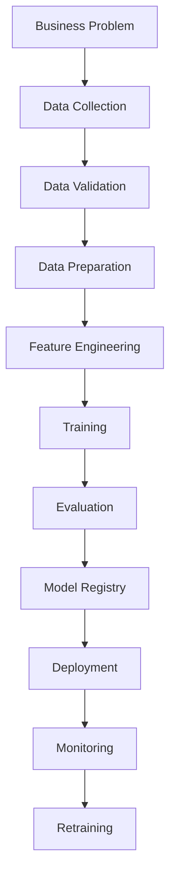
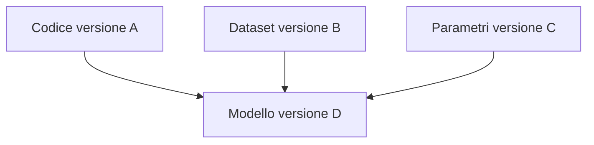

# MLOps e Machine Learning in Produzione

Modulo: Machine Learning - Produzione, Deployment e Governance

---

## Obiettivo del capitolo

Questo capitolo spiega come portare un modello di Machine Learning dalla fase di sviluppo alla produzione.

Nei capitoli precedenti sono stati studiati gli algoritmi, il training, la valutazione e le metriche. In un contesto reale, però, un modello non è utile solo perché ottiene una buona accuracy su un test set: deve essere riproducibile, distribuibile, monitorabile, aggiornabile e integrato in un sistema software.

Al termine dello studio dovresti essere in grado di:

- comprendere cosa sia MLOps;
- distinguere un esperimento in notebook da un sistema ML in produzione;
- descrivere il ciclo di vita completo di un progetto ML;
- capire il ruolo di Git, GitHub, Docker, API, CI/CD e cloud;
- conoscere le differenze tra Data Scientist, ML Engineer e Data Engineer;
- spiegare versionamento di codice, dati, feature e modelli;
- comprendere model registry, experiment tracking e feature store;
- esporre un modello tramite API REST con FastAPI;
- distinguere batch serving, real-time serving e streaming;
- riconoscere data drift, concept drift e prediction drift;
- impostare monitoraggio, alerting e retraining;
- conoscere le principali strategie di deployment;
- comprendere le basi di governance, sicurezza e riproducibilità.

---

## Introduzione

MLOps significa Machine Learning Operations.

È l’insieme di pratiche, processi e strumenti che permettono di sviluppare, distribuire e mantenere modelli di Machine Learning in ambienti reali.

Un progetto ML non termina quando il modello viene addestrato.

In produzione bisogna gestire:

- dati che cambiano;
- utenti reali;
- errori applicativi;
- latenze;
- costi computazionali;
- versioni differenti del modello;
- rollback;
- monitoraggio;
- retraining;
- sicurezza;
- responsabilità sulle decisioni automatizzate.

Il punto centrale è che il Machine Learning in produzione non è solo un problema di modellazione, ma un problema di sistema.

---

## Perché esiste MLOps

Molti progetti di Machine Learning falliscono nel passaggio dal notebook alla produzione.

Il notebook è utile per esplorare dati, testare ipotesi e costruire prototipi. Tuttavia, da solo non garantisce:

- riproducibilità;
- test automatici;
- tracciamento degli esperimenti;
- deployment controllato;
- monitoraggio continuo;
- aggiornamento dei modelli;
- collaborazione tra più ruoli;
- controllo delle versioni;
- gestione degli errori in produzione.

MLOps nasce per colmare questo gap.

L’obiettivo è trasformare un esperimento ML in un servizio affidabile.

---

## Notebook vs Produzione

Un notebook è spesso interattivo, manuale e orientato all’esplorazione.

Un sistema in produzione deve invece essere automatizzato, testabile e osservabile.

Differenza principale:

Notebook

- esecuzione manuale;
- celle eseguite in ordine variabile;
- dipendenze spesso implicite;
- output non sempre riproducibile;
- utile per ricerca e prototipazione.

Produzione

- pipeline automatizzate;
- codice modulare;
- dati validati;
- ambiente controllato;
- modello versionato;
- API o job schedulati;
- monitoraggio continuo;
- rollback possibile.

Un buon workflow MLOps non elimina i notebook, ma li trasforma in codice riutilizzabile.

---

## Relazione tra ML, DevOps e Data Engineering

MLOps unisce tre mondi.

Machine Learning

Si occupa di:

- analisi dei dati;
- scelta dell’algoritmo;
- training;
- valutazione;
- metriche;
- generalizzazione.

DevOps

Si occupa di:

- automazione;
- test;
- build;
- deploy;
- infrastruttura;
- monitoraggio;
- affidabilità.

Data Engineering

Si occupa di:

- raccolta dei dati;
- pipeline ETL/ELT;
- storage;
- qualità dei dati;
- orchestrazione;
- disponibilità delle feature.

MLOps integra questi elementi per garantire che i modelli siano sviluppati e mantenuti con disciplina ingegneristica.

---

## Ruoli principali in un progetto MLOps

Data Scientist

Si concentra su:

- analisi esplorativa;
- feature engineering;
- scelta e addestramento dei modelli;
- valutazione delle performance;
- interpretazione dei risultati.

ML Engineer

Si concentra su:

- trasformare prototipi in codice robusto;
- creare pipeline di training;
- servire modelli tramite API o job batch;
- ottimizzare performance e scalabilità;
- gestire deployment, monitoraggio e retraining.

Data Engineer

Si concentra su:

- ingestione dati;
- trasformazioni dati;
- data warehouse o data lake;
- pipeline schedulate;
- qualità e disponibilità delle sorgenti.

DevOps / Platform Engineer

Si concentra su:

- infrastruttura;
- container;
- Kubernetes;
- CI/CD;
- observability;
- sicurezza;
- ambienti cloud.

Domain Expert

Si concentra su:

- validità business del problema;
- interpretazione degli errori;
- vincoli operativi;
- impatto delle predizioni nel mondo reale.

Un progetto MLOps maturo richiede collaborazione tra questi ruoli.

---

## Ciclo di vita completo del Machine Learning

Un progetto ML in produzione segue un ciclo continuo.



Questo ciclo non è lineare una volta per tutte.

In produzione il modello viene osservato, confrontato con nuovi dati e aggiornato quando necessario.

---

## 1. Business Problem

Ogni progetto ML deve partire da un problema concreto.

Domande fondamentali:

- quale decisione vogliamo supportare?
- quale metrica business vogliamo migliorare?
- quanto costa un falso positivo?
- quanto costa un falso negativo?
- quale latenza è accettabile?
- quanto spesso arrivano nuovi dati?
- il modello deve spiegare le proprie decisioni?

Un modello accurato ma non utile operativamente non è un buon modello di produzione.

---

## 2. Raccolta dati

I dati possono provenire da:

- database relazionali;
- file CSV o Parquet;
- data warehouse;
- data lake;
- API esterne;
- stream di eventi;
- log applicativi;
- sistemi transazionali.

In questa fase è importante documentare:

- origine dei dati;
- significato delle colonne;
- frequenza di aggiornamento;
- qualità attesa;
- vincoli di privacy;
- eventuali trasformazioni già applicate.

Senza una buona comprensione dei dati, il modello rischia di apprendere relazioni fragili o sbagliate.

---

## 3. Data Validation

La validazione dei dati controlla che i dati in ingresso rispettino aspettative minime.

Esempi:

- le colonne previste sono presenti;
- i tipi sono corretti;
- non ci sono troppi valori mancanti;
- i range numerici sono plausibili;
- le categorie appartengono a valori noti;
- non ci sono duplicati inattesi;
- la distribuzione non è cambiata drasticamente.

Esempio:

- età non negativa;
- prezzo maggiore di zero;
- email non vuota;
- categoria prodotto presente nel catalogo;
- data evento non futura.

La data validation è importante sia prima del training sia prima della predizione in produzione.

---

## 4. Feature Engineering

Il feature engineering consiste nel trasformare i dati grezzi in variabili utili al modello.

Esempi:

- estrarre giorno della settimana da una data;
- calcolare il numero di acquisti negli ultimi 30 giorni;
- codificare variabili categoriche;
- normalizzare feature numeriche;
- aggregare eventi storici;
- creare indicatori booleani.

In produzione il feature engineering deve essere coerente tra training e serving.

Errore comune:

- calcolare feature in modo diverso durante il training e durante la predizione.

Questo problema prende spesso il nome di training-serving skew.

---

## 5. Training

Il training addestra il modello sui dati disponibili.

In un workflow MLOps il training dovrebbe essere:

- riproducibile;
- parametrizzato;
- tracciato;
- automatizzabile;
- confrontabile con esperimenti precedenti.

Durante il training è importante salvare:

- codice utilizzato;
- versione dei dati;
- iperparametri;
- metriche;
- ambiente software;
- modello finale;
- eventuali scaler o trasformazioni;
- seed casuali.

Il modello non è solo il file finale, ma l’intero processo che lo ha generato.

---

## 6. Evaluation

La valutazione stabilisce se il modello è adatto alla produzione.

Non basta osservare una singola metrica.

È necessario valutare:

- performance sul test set;
- confronto con baseline;
- errori per sottogruppi;
- stabilità delle predizioni;
- interpretabilità;
- costo computazionale;
- latenza;
- robustezza a input anomali;
- impatto business.

Un modello può avere accuracy elevata ma essere inadatto se fallisce sui casi più importanti.

---

## 7. Model Registry

Il model registry è un archivio centralizzato delle versioni dei modelli.

Permette di tracciare:

- nome del modello;
- versione;
- autore;
- data di training;
- dataset utilizzato;
- metriche;
- parametri;
- artifact;
- stato del modello.

Stati tipici:

- candidate;
- staging;
- production;
- archived.

Il registry aiuta a rispondere a domande pratiche:

- quale modello è in produzione?
- con quali dati è stato addestrato?
- quali metriche aveva prima del deployment?
- chi lo ha approvato?
- come posso tornare alla versione precedente?

---

## 8. Deployment

Il deployment rende il modello disponibile ad altri sistemi.

Le modalità principali sono:

- batch prediction;
- real-time API;
- streaming;
- edge deployment;
- embedded model in un’applicazione.

Il deployment deve essere controllato, osservabile e reversibile.

In produzione bisogna sempre prevedere:

- health check;
- logging;
- gestione errori;
- metriche;
- rollback;
- limiti di risorse;
- sicurezza;
- gestione delle versioni.

---

## 9. Monitoring

Il monitoraggio controlla il comportamento del sistema dopo il deployment.

Si monitorano almeno quattro livelli.

Sistema

- latenza;
- throughput;
- error rate;
- utilizzo CPU;
- utilizzo memoria;
- disponibilità del servizio.

Dati

- valori mancanti;
- schema;
- range;
- distribuzioni;
- categorie nuove;
- outlier.

Modello

- distribuzione delle predizioni;
- confidence score;
- accuratezza quando arrivano le label;
- precision;
- recall;
- F1-score;
- calibrazione;
- drift.

Business

- conversioni;
- frodi rilevate;
- ricavi;
- costi evitati;
- reclami;
- interventi manuali.

Un modello può funzionare tecnicamente ma peggiorare una metrica business.

---

## 10. Retraining

Il retraining aggiorna il modello usando dati più recenti.

Può essere:

- manuale;
- schedulato;
- attivato da drift;
- attivato da peggioramento delle metriche;
- continuo.

Il retraining non dovrebbe essere automatico senza controlli.

Prima di promuovere un nuovo modello bisogna verificare:

- qualità dei dati;
- metriche offline;
- confronto con il modello corrente;
- performance su sottogruppi;
- assenza di data leakage;
- compatibilità con l’API;
- possibilità di rollback.

---

## MLOps Maturity Model

Il livello di maturità MLOps indica quanto un’organizzazione è capace di gestire modelli in modo automatizzato e affidabile.

Livello 0 - Manuale

Caratteristiche:

- notebook locali;
- training manuale;
- nessun tracking degli esperimenti;
- deployment manuale o assente;
- monitoraggio minimo.

Rischio principale:

- il modello non è riproducibile.

---

## Livello 1 - Script e repository

Caratteristiche:

- codice versionato con Git;
- script di training;
- separazione tra codice e dati;
- prime convenzioni di progetto;
- deployment ancora poco automatizzato.

Rischio principale:

- processi ancora fragili e dipendenti da singole persone.

---

## Livello 2 - Pipeline automatizzate

Caratteristiche:

- pipeline di preprocessing e training;
- test automatici;
- artifact salvati;
- tracking esperimenti;
- deployment più strutturato.

Rischio principale:

- monitoraggio e governance ancora incompleti.

---

## Livello 3 - CI/CD e monitoraggio

Caratteristiche:

- CI/CD per codice e modelli;
- model registry;
- monitoraggio dati e modello;
- alerting;
- rollback;
- ambienti staging e production.

Rischio principale:

- complessità operativa più elevata.

---

## Livello 4 - MLOps avanzato

Caratteristiche:

- retraining automatico con quality gate;
- governance completa;
- lineage dati-modelli;
- deployment canary o shadow;
- osservabilità end-to-end;
- infrastruttura scalabile.

Rischio principale:

- automazione eccessiva senza controllo umano.

---

## Versionamento in MLOps

Nel software tradizionale si versiona principalmente il codice.

Nel Machine Learning bisogna versionare più elementi.

Codice

- script di training;
- pipeline;
- codice API;
- configurazioni;
- test.

Dati

- dataset di training;
- dataset di validazione;
- dataset di test;
- snapshot temporali;
- schema.

Modelli

- file serializzati;
- metriche;
- preprocessing;
- parametri;
- dipendenze.

Configurazioni

- hyperparameter;
- path;
- feature abilitate;
- soglie decisionali;
- ambiente di esecuzione.

Senza versionamento non è possibile spiegare perché una predizione sia stata prodotta da una certa versione del sistema.

---

## Git, GitHub e Codespaces

Git è il sistema di versionamento distribuito più usato nello sviluppo software.

In MLOps viene utilizzato per versionare:

- codice;
- configurazioni;
- documentazione;
- test;
- workflow CI/CD;
- Dockerfile;
- file di infrastruttura.

GitHub aggiunge funzionalità collaborative:

- repository remoti;
- pull request;
- code review;
- issue;
- GitHub Actions;
- wiki e documentazione;
- gestione permessi.

Codespaces permette di creare ambienti di sviluppo nel cloud già configurati.

È utile quando:

- il setup locale è complesso;
- più studenti o sviluppatori devono lavorare nello stesso ambiente;
- si vuole ridurre il problema “sul mio computer funziona”.

Non dovrebbero essere salvati direttamente in Git:

- dataset grandi;
- password;
- token;
- chiavi private;
- modelli pesanti;
- file temporanei;
- artifact generati automaticamente.

---

## Versionamento di dati e modelli

Per dati e modelli si usano strumenti dedicati.

Esempi:

- DVC;
- MLflow;
- LakeFS;
- Weights & Biases;
- storage object come S3, Azure Blob o GCS.

Il principio è separare:

- repository Git per codice leggero;
- storage esterno per dati e artifact grandi;
- metadati per collegare codice, dati e modello.

Esempio concettuale:



Questo collegamento prende il nome di lineage.

---

## Experiment Tracking

L’experiment tracking serve a registrare gli esperimenti di training.

Per ogni run è utile salvare:

- data e ora;
- autore;
- commit Git;
- dataset;
- feature usate;
- algoritmo;
- iperparametri;
- metriche;
- grafici;
- artifact;
- note.

Senza experiment tracking diventa difficile capire perché un modello fosse migliore di un altro.

Esempio di informazioni da tracciare:

Esperimento 12

- modello: Random Forest;
- n_estimators: 300;
- max_depth: 12;
- dataset: clienti_2026_05;
- accuracy: 0.91;
- recall classe positiva: 0.74;
- note: migliore recall rispetto alla baseline.

---

## Feature Store

Un feature store è un repository centralizzato per gestire feature riutilizzabili.

Serve a garantire che le stesse feature siano disponibili:

- durante il training;
- durante la predizione online;
- durante i job batch.

Vantaggi:

- evita duplicazione di logica;
- riduce training-serving skew;
- permette riuso tra team;
- centralizza definizioni e documentazione;
- migliora consistenza delle feature.

Esempio:

Feature: acquisti_ultimi_30_giorni

- definizione: numero di ordini completati negli ultimi 30 giorni;
- chiave: customer_id;
- frequenza aggiornamento: giornaliera;
- tipo: intero;
- usata da: modello churn, modello raccomandazioni.

---

## Data Leakage

Il data leakage avviene quando il modello usa informazioni che non sarebbero disponibili al momento della predizione reale.

È uno degli errori più pericolosi in Machine Learning.

Esempio:

Vogliamo prevedere se un cliente abbandonerà il servizio.

Errore:

- usare come feature “data_chiusura_account”.

Questa informazione è disponibile solo dopo che il cliente ha già abbandonato.

Conseguenza:

- metriche offline altissime;
- modello inutilizzabile in produzione.

In MLOps il leakage deve essere prevenuto con:

- review delle feature;
- split temporali corretti;
- validazione della disponibilità delle informazioni;
- separazione rigorosa tra training, validation e test.

---

## Fondamenti HTTP

Molti modelli vengono esposti tramite API web.

Per questo motivo è importante comprendere le basi di HTTP.

HTTP è il protocollo usato da client e server per comunicare sul web.

Una richiesta HTTP contiene:

- metodo;
- URL;
- headers;
- eventuale body.

Una risposta HTTP contiene:

- status code;
- headers;
- eventuale body.

Metodi comuni:

- GET: leggere una risorsa;
- POST: creare una risorsa o inviare dati;
- PUT: sostituire una risorsa;
- PATCH: modificare parzialmente una risorsa;
- DELETE: eliminare una risorsa.

---

## REST, JSON e CRUD

REST è uno stile architetturale per progettare API basate su risorse.

JSON è un formato testuale molto usato per scambiare dati tra client e server.

Esempio JSON:

```json
{
  "age": 42,
  "income": 58000,
  "country": "IT"
}
```

CRUD indica le operazioni base sulle risorse:

- Create;
- Read;
- Update;
- Delete.

In un servizio ML, però, l’operazione più importante è spesso:

- predict.

Esempio:

POST /predict

Body:

```json
{
  "features": [42, 58000, 3]
}
```

Risposta:

```json
{
  "prediction": 1,
  "probability": 0.87,
  "model_version": "churn-model-12"
}
```

---

## Status Code HTTP

Gli status code indicano l’esito di una richiesta.

I più comuni sono:

- 200 OK: richiesta completata;
- 201 Created: risorsa creata;
- 400 Bad Request: input non valido;
- 401 Unauthorized: autenticazione mancante;
- 403 Forbidden: accesso negato;
- 404 Not Found: risorsa non trovata;
- 422 Unprocessable Entity: dati formalmente validi ma non accettabili;
- 500 Internal Server Error: errore interno del server;
- 503 Service Unavailable: servizio non disponibile.

In un’API ML è importante distinguere:

- errore del client;
- errore del modello;
- errore infrastrutturale.

---

## Esempi Python con Requests

La libreria requests permette di inviare richieste HTTP da Python.

GET:

```python
import requests

response = requests.get("https://api.example.com/health")

if response.status_code == 200:
    print(response.json())
else:
    print("Errore:", response.status_code)
```

POST:

```python
import requests

payload = {
    "features": [42, 58000, 3]
}

response = requests.post("https://api.example.com/predict", json=payload)

if response.status_code == 200:
    result = response.json()
    print(result["prediction"])
else:
    print("Errore:", response.status_code, response.text)
```

Questi esempi rappresentano il modo in cui un altro sistema potrebbe interrogare un modello in produzione.

---

## Architettura FastAPI

FastAPI è un framework Python per costruire API moderne.

È molto usato in MLOps perché:

- è veloce;
- genera documentazione automatica;
- usa Pydantic per validare gli input;
- supporta OpenAPI;
- è semplice da integrare con modelli Python;
- funziona bene con Uvicorn e container Docker.

Componenti principali:

- FastAPI app;
- route;
- Pydantic models;
- funzioni endpoint;
- HTTPException;
- middleware;
- documentazione Swagger;
- server ASGI.

---

## Esempio FastAPI per un modello ML

Esempio minimale di API di predizione.

```python
from fastapi import FastAPI, HTTPException
from pydantic import BaseModel
import joblib

app = FastAPI(title="ML Prediction API")

model = joblib.load("model.joblib")


class PredictionRequest(BaseModel):
    features: list[float]


class PredictionResponse(BaseModel):
    prediction: int
    probability: float | None = None
    model_version: str


@app.get("/health")
def health():
    return {"status": "ok"}


@app.post("/predict", response_model=PredictionResponse)
def predict(request: PredictionRequest):
    expected_features = model.n_features_in_

    if len(request.features) != expected_features:
        raise HTTPException(
            status_code=400,
            detail=f"Expected {expected_features} features"
        )

    X = [request.features]
    prediction = int(model.predict(X)[0])

    probability = None
    if hasattr(model, "predict_proba"):
        probability = float(model.predict_proba(X)[0].max())

    return PredictionResponse(
        prediction=prediction,
        probability=probability,
        model_version="v1"
    )
```

Avvio locale:

```bash
uvicorn app:app --reload
```

Documentazione automatica:

```text
http://127.0.0.1:8000/docs
```

---

## Pipeline scikit-learn per produzione

In produzione è preferibile salvare una Pipeline completa, non solo il modello.

Esempio:

```python
from sklearn.datasets import load_breast_cancer
from sklearn.linear_model import LogisticRegression
from sklearn.metrics import classification_report
from sklearn.model_selection import train_test_split
from sklearn.pipeline import Pipeline
from sklearn.preprocessing import StandardScaler
import joblib

data = load_breast_cancer()
X = data.data
y = data.target

X_train, X_test, y_train, y_test = train_test_split(
    X,
    y,
    test_size=0.2,
    random_state=42,
    stratify=y
)

pipeline = Pipeline([
    ("scaler", StandardScaler()),
    ("model", LogisticRegression(max_iter=1000))
])

pipeline.fit(X_train, y_train)

y_pred = pipeline.predict(X_test)
print(classification_report(y_test, y_pred))

joblib.dump(pipeline, "model.joblib")
```

Vantaggio:

- lo scaling viene applicato nello stesso modo in training e in produzione.

Questo riduce il rischio di errori tra ambiente sperimentale e ambiente reale.

---

## Batch Serving

Nel batch serving il modello produce predizioni su gruppi di dati a intervalli regolari.

Esempi:

- calcolare ogni notte il rischio churn dei clienti;
- aggiornare raccomandazioni ogni ora;
- assegnare scoring creditizio a fine giornata;
- generare previsioni di domanda settimanali.

Vantaggi:

- architettura più semplice;
- meno vincoli di latenza;
- facile integrazione con data warehouse;
- costi più prevedibili.

Svantaggi:

- predizioni non sempre aggiornate in tempo reale;
- non adatto a casi che richiedono risposta immediata.

---

## Real-Time Serving

Nel real-time serving il modello risponde a richieste individuali in tempo quasi immediato.

Esempi:

- rilevamento frodi durante un pagamento;
- ranking di prodotti in una pagina web;
- suggerimento personalizzato in un’app;
- classificazione di un ticket appena creato.

Vantaggi:

- predizioni aggiornate;
- integrazione diretta con applicazioni;
- utile per decisioni immediate.

Svantaggi:

- requisiti di latenza;
- maggiore complessità infrastrutturale;
- necessità di scalabilità;
- gestione di errori e timeout.

---

## Streaming

Nello streaming il modello elabora eventi continui.

Esempi:

- sensori industriali;
- transazioni finanziarie;
- clickstream web;
- log applicativi;
- eventi IoT.

Tecnologie tipiche:

- Kafka;
- Spark Streaming;
- Flink;
- cloud event streaming.

Lo streaming è utile quando il valore dei dati diminuisce rapidamente con il tempo.

---

## Model Serving

Il model serving è l’insieme delle tecniche usate per rendere disponibile un modello.

Aspetti importanti:

- formato del modello;
- caricamento in memoria;
- validazione input;
- preprocessing;
- predizione;
- postprocessing;
- logging;
- gestione errori;
- scalabilità;
- sicurezza.

Un endpoint di predizione dovrebbe essere:

- stabile;
- documentato;
- versionato;
- testato;
- monitorato.

---

## Strategie di Deployment

Il deployment di un modello deve ridurre il rischio di introdurre errori in produzione.

Strategie comuni:

- rolling update;
- blue-green deployment;
- canary deployment;
- shadow deployment;
- A/B testing.

---

## Rolling Update

Nel rolling update la nuova versione sostituisce gradualmente la precedente.

Vantaggi:

- downtime ridotto;
- processo relativamente semplice;
- adatto a molti servizi web.

Rischio:

- per un periodo possono convivere versioni diverse.

---

## Blue-Green Deployment

Nel blue-green deployment esistono due ambienti:

- blue: ambiente attualmente in produzione;
- green: nuova versione pronta.

Quando la nuova versione è verificata, il traffico viene spostato da blue a green.

Vantaggi:

- rollback rapido;
- ambiente nuovo testabile prima del cambio;
- separazione chiara tra versioni.

Svantaggio:

- richiede risorse doppie durante il passaggio.

---

## Canary Deployment

Nel canary deployment la nuova versione riceve solo una piccola percentuale di traffico.

Esempio:

- 5% traffico al modello nuovo;
- 95% traffico al modello vecchio.

Se le metriche sono buone, la percentuale aumenta.

Vantaggi:

- rischio controllato;
- test su dati reali;
- rollback semplice.

È una strategia molto utile per modelli ML, perché le metriche offline non garantiscono sempre il comportamento reale.

---

## Shadow Deployment

Nel shadow deployment il nuovo modello riceve copie delle richieste reali ma le sue predizioni non influenzano gli utenti.

Vantaggi:

- confronto su traffico reale;
- nessun impatto diretto sugli utenti;
- utile per misurare latenza e stabilità.

Svantaggio:

- costi aggiuntivi;
- bisogna gestire correttamente logging e privacy.

---

## A/B Testing

Nell’A/B testing due modelli vengono confrontati su gruppi diversi di utenti.

Serve a misurare l’impatto reale su metriche business.

Esempi:

- conversion rate;
- click-through rate;
- retention;
- riduzione frodi;
- soddisfazione utente.

È importante distinguere:

- metrica ML offline;
- metrica business online.

Un modello con F1-score migliore non sempre migliora il prodotto.

---

## Docker

Docker permette di eseguire un’applicazione in un container.

Un container include:

- codice;
- dipendenze;
- runtime;
- configurazione di base.

Vantaggi:

- portabilità;
- isolamento;
- riproducibilità;
- deployment più semplice;
- coerenza tra ambiente locale e produzione.

Esempio Dockerfile per API FastAPI:

```dockerfile
FROM python:3.11-slim

WORKDIR /app

COPY requirements.txt .
RUN pip install --no-cache-dir -r requirements.txt

COPY app.py .
COPY model.joblib .

CMD ["uvicorn", "app:app", "--host", "0.0.0.0", "--port", "8000"]
```

Build:

```bash
docker build -t ml-api .
```

Run:

```bash
docker run -p 8000:8000 ml-api
```

---

## Kubernetes

Kubernetes è una piattaforma per orchestrare container.

Permette di gestire:

- deployment;
- replica;
- scaling;
- service discovery;
- restart automatico;
- configurazioni;
- segreti;
- health check;
- rolling update.

Concetti principali:

- Pod: unità minima di esecuzione;
- Deployment: gestisce versioni e repliche;
- Service: espone i pod;
- ConfigMap: configurazione non segreta;
- Secret: configurazione sensibile;
- Ingress: accesso HTTP dall’esterno;
- HPA: autoscaling orizzontale.

Kubernetes è potente, ma non sempre necessario.

Per progetti piccoli può essere sufficiente:

- job schedulato;
- API FastAPI;
- container Docker;
- servizio gestito cloud.

---

## CI/CD per Machine Learning

CI/CD significa Continuous Integration e Continuous Delivery/Deployment.

Nel software tradizionale la pipeline verifica codice, test e build.

Nel Machine Learning deve controllare anche dati, training, metriche e modelli.


Quality gate tipici:

- test passati;
- metriche non peggiori della baseline;
- latenza sotto soglia;
- nessun errore di schema;
- dimensione modello accettabile;
- approvazione umana per modelli critici.

---

## Testing in MLOps

I test in MLOps coprono più livelli.

Unit test

Verificano singole funzioni.

Esempio:

- una funzione di preprocessing gestisce valori mancanti.

Data test

Verificano qualità e schema dei dati.

Esempio:

- la colonna target non contiene valori nulli.

Training test

Verificano che il training produca un modello valido.

Esempio:

- la pipeline si addestra senza errori su un piccolo dataset.

Model test

Verificano comportamento e metriche.

Esempio:

- il modello supera una baseline minima.

API test

Verificano gli endpoint.

Esempio:

- /health restituisce 200;
- /predict rifiuta input con numero errato di feature.

Integration test

Verificano che più componenti funzionino insieme.

Esempio:

- API, modello, logging e database comunicano correttamente.

Smoke test

Verificano rapidamente che il servizio appena deployato risponda.

---

## Infrastructure as Code

Infrastructure as Code significa definire l’infrastruttura tramite file versionati.

Esempi di strumenti:

- Terraform;
- CloudFormation;
- Pulumi;
- Kubernetes manifest;
- Helm chart.

Vantaggi:

- riproducibilità;
- code review;
- audit;
- rollback;
- coerenza tra ambienti;
- minore lavoro manuale.

In MLOps può descrivere:

- bucket di storage;
- database;
- cluster Kubernetes;
- permessi;
- secret manager;
- sistemi di monitoraggio;
- endpoint di serving.

---

## Cloud per MLOps

I principali cloud provider offrono servizi utili per MLOps.

Categorie comuni:

- storage dati;
- compute per training;
- container registry;
- orchestrazione container;
- model registry;
- feature store;
- pipeline ML;
- monitoraggio;
- gestione segreti;
- identity and access management.

Esempi:

- AWS;
- Azure;
- Google Cloud.

Il cloud non sostituisce i principi MLOps.

Anche con servizi gestiti bisogna definire:

- versionamento;
- test;
- metriche;
- governance;
- monitoraggio;
- responsabilità operative.

---

## Hugging Face Hub

Hugging Face Hub è una piattaforma per condividere e usare:

- modelli;
- dataset;
- demo;
- Spaces;
- tokenizers;
- documentazione.

È molto utile per:

- prototipazione rapida;
- NLP;
- Computer Vision;
- modelli generativi;
- condivisione di artifact.

In produzione bisogna comunque verificare:

- licenza del modello;
- qualità sui propri dati;
- dimensione;
- latenza;
- costi di inferenza;
- rischi di sicurezza;
- versionamento preciso.

Usare un modello pre-addestrato non elimina la necessità di monitoraggio.

---

## Monitoraggio dei modelli

Il monitoraggio di un modello ML è diverso dal monitoraggio di un’applicazione tradizionale.

Un’applicazione può essere tecnicamente attiva ma produrre predizioni sempre peggiori.

Esempi:

- l’API risponde 200;
- la latenza è bassa;
- il container è sano;
- ma il modello sbaglia perché i dati sono cambiati.

Per questo motivo servono metriche specifiche per ML.

---

## Data Drift

Il data drift indica un cambiamento nella distribuzione dei dati in input.

Esempio:

Un modello di previsione vendite è stato addestrato su dati pre-pandemia.

Dopo un cambiamento del comportamento dei clienti, le feature in input hanno distribuzioni diverse.

Possibili segnali:

- aumento di valori mancanti;
- nuove categorie;
- media e varianza cambiate;
- outlier più frequenti;
- distribuzione geografica diversa;
- stagionalità cambiata.

Il data drift non implica automaticamente che il modello sia sbagliato, ma indica un rischio.

---

## Concept Drift

Il concept drift indica un cambiamento nella relazione tra input e target.

Esempio:

In passato un certo comportamento online indicava alta probabilità di acquisto.

Dopo un cambiamento del mercato, lo stesso comportamento non ha più lo stesso significato.

La distribuzione degli input può anche essere simile, ma la relazione con l’output è cambiata.

Il concept drift è spesso più difficile da rilevare perché richiede label aggiornate.

---

## Prediction Drift

Il prediction drift indica un cambiamento nella distribuzione delle predizioni del modello.

Esempio:

Un classificatore che normalmente assegna il 10% dei casi alla classe positiva inizia improvvisamente ad assegnarne il 40%.

Cause possibili:

- data drift;
- bug nel preprocessing;
- cambiamento reale della popolazione;
- problema nei dati in ingresso;
- nuova campagna marketing;
- modifica del prodotto.

Il prediction drift è utile perché può essere osservato anche quando le label reali non sono ancora disponibili.

---

## Metriche di monitoraggio

Metriche tecniche:

- latency;
- throughput;
- error rate;
- timeout;
- CPU;
- memoria;
- disponibilità.

Metriche sui dati:

- numero di record;
- valori mancanti;
- range;
- cardinalità;
- distribuzioni;
- outlier;
- categorie sconosciute.

Metriche sulle predizioni:

- distribuzione classi predette;
- media delle probabilità;
- confidence score;
- percentuale di rifiuti;
- soglie superate.

Metriche di performance:

- accuracy;
- precision;
- recall;
- F1-score;
- ROC-AUC;
- MAE;
- RMSE.

Metriche business:

- conversion rate;
- ricavi;
- costi;
- frodi bloccate;
- ticket risolti;
- churn ridotto.

---

## Alerting

Gli alert avvisano quando qualcosa supera una soglia.

Esempi:

- error rate maggiore del 5%;
- latenza p95 superiore a 300 ms;
- percentuale di valori nulli superiore al 10%;
- distribuzione delle predizioni molto diversa dal normale;
- accuracy sotto soglia;
- numero di richieste anomalo.

Un buon alert deve essere:

- utile;
- comprensibile;
- associato a un’azione;
- non troppo rumoroso.

Troppi alert inutili portano a ignorare anche quelli importanti.

---

## Logging

Il logging registra informazioni utili per diagnosi e audit.

In un servizio ML si possono loggare:

- timestamp;
- model_version;
- request_id;
- input validati;
- predizione;
- probabilità;
- latenza;
- codice errore;
- informazioni di contesto.

Attenzione:

- non loggare dati sensibili se non necessario;
- mascherare informazioni personali;
- rispettare le policy aziendali;
- applicare retention dei log.

I log sono fondamentali per capire cosa è successo dopo un errore.

---

## Sicurezza in MLOps

Un sistema ML in produzione deve essere sicuro.

Aspetti importanti:

- autenticazione;
- autorizzazione;
- gestione dei segreti;
- cifratura;
- controllo accessi ai dati;
- validazione input;
- protezione da abuso dell’API;
- rate limiting;
- audit log;
- dipendenze aggiornate.

Rischi specifici dei modelli:

- data poisoning;
- prompt injection nei sistemi LLM;
- model extraction;
- inversion attack;
- input avversariali;
- leakage di dati sensibili.

La sicurezza deve essere considerata fin dall’inizio, non aggiunta solo dopo il deployment.

---

## Governance e responsabilità

La governance definisce regole, responsabilità e controlli sui modelli.

Include:

- chi può addestrare modelli;
- chi può approvarli;
- chi può mandarli in produzione;
- quali metriche devono essere rispettate;
- quali dati possono essere usati;
- come gestire incidenti;
- come documentare decisioni;
- come ritirare modelli obsoleti.

Strumenti utili:

- model card;
- datasheet del dataset;
- audit trail;
- model registry;
- policy di accesso;
- report di fairness;
- documentazione delle limitazioni.

In ambiti critici, la governance è importante quanto l’accuratezza.

---

## Model Card

Una model card documenta un modello.

Può contenere:

- nome del modello;
- versione;
- scopo;
- dati di training;
- metriche;
- limiti noti;
- popolazioni su cui funziona bene;
- popolazioni su cui funziona peggio;
- considerazioni etiche;
- modalità di utilizzo corretto;
- contatti del team responsabile.

La model card aiuta utenti e stakeholder a capire cosa il modello può e non può fare.

---

## Explainability

L’explainability riguarda la capacità di spiegare le decisioni di un modello.

È importante quando:

- le decisioni hanno impatto sulle persone;
- serve fiducia degli utenti;
- il dominio è regolato;
- bisogna diagnosticare errori;
- si confrontano modelli diversi.

Modelli più interpretabili:

- Logistic Regression;
- Decision Tree;
- modelli lineari;
- regole.

Modelli meno interpretabili:

- reti neurali profonde;
- ensemble complessi;
- modelli generativi.

Tecniche utili:

- feature importance;
- permutation importance;
- SHAP;
- LIME;
- partial dependence plot.

L’explainability non garantisce automaticamente correttezza, ma aiuta a individuare problemi.

---

## Costi e scalabilità

Un modello in produzione ha costi.

Costi principali:

- training;
- inferenza;
- storage;
- rete;
- monitoraggio;
- logging;
- manutenzione;
- team operativo.

La scalabilità dipende da:

- numero di richieste;
- latenza richiesta;
- dimensione del modello;
- tipo di hardware;
- batch size;
- caching;
- parallelismo;
- autoscaling.

Ottimizzazioni possibili:

- usare modelli più piccoli;
- batch inference;
- caching delle predizioni;
- quantizzazione;
- distillazione;
- autoscaling;
- scelta corretta della frequenza di retraining.

Il modello migliore non è sempre quello più grande, ma quello che offre il miglior compromesso tra qualità, costo e affidabilità.

---

## Workflow consigliato per un progetto MLOps semplice

Per un progetto didattico o iniziale può bastare una struttura semplice.

Esempio:

```text
project/
  data/
  notebooks/
  src/
    train.py
    predict.py
    preprocessing.py
  models/
  tests/
  app.py
  requirements.txt
  Dockerfile
  README.md
```

Responsabilità:

- notebooks: esplorazione;
- src/train.py: training riproducibile;
- src/preprocessing.py: trasformazioni dati;
- app.py: API FastAPI;
- tests: test automatici;
- models: artifact locali o puntatori a storage esterno;
- Dockerfile: ambiente di deployment;
- README.md: istruzioni.

Passaggi minimi:

1. esplora in notebook;
2. sposta la logica stabile in script;
3. crea una pipeline scikit-learn;
4. salva il modello;
5. crea endpoint /health e /predict;
6. aggiungi test;
7. containerizza;
8. monitora input, output e latenza;
9. documenta limiti e versioni.

---

## Esempio di checklist pre-deployment

Prima di mandare un modello in produzione, verificare:

- il codice è versionato;
- il dataset è identificabile;
- le metriche sono documentate;
- il modello supera una baseline;
- il preprocessing è incluso nella pipeline;
- l’API valida gli input;
- gli errori sono gestiti;
- esiste un endpoint /health;
- i log includono model_version;
- le dipendenze sono fissate;
- il container si avvia correttamente;
- esiste una procedura di rollback;
- sono definite soglie di monitoraggio;
- è chiaro chi risponde agli incidenti.

---

## Errori comuni

Errore 1: considerare il notebook come prodotto finale.

Il notebook è uno strumento di ricerca, non un sistema di produzione.

---

Errore 2: salvare solo il modello e non il preprocessing.

Se durante il training è stato usato uno scaler, anche lo scaler deve essere incluso nel processo di inferenza.

---

Errore 3: non versionare dati e modelli.

Senza versionamento non è possibile ricostruire il processo che ha generato un modello.

---

Errore 4: ignorare il drift.

Le performance possono peggiorare anche se il codice non cambia.

---

Errore 5: monitorare solo la latenza.

Un modello può rispondere velocemente ma produrre predizioni sbagliate.

---

Errore 6: deployare senza rollback.

Ogni nuova versione può fallire.

Serve sempre una strategia per tornare alla versione precedente.

---

Errore 7: usare metriche offline non collegate al business.

Una metrica ML migliore non garantisce automaticamente un impatto positivo.

---

Errore 8: automatizzare retraining senza controlli.

Un modello retrainato su dati sporchi può peggiorare rapidamente.

---

Errore 9: non gestire input anomali.

Le API esposte in produzione devono aspettarsi input incompleti, errati o malevoli.

---

Errore 10: non documentare i limiti del modello.

Ogni modello ha contesti in cui non dovrebbe essere usato.

---

## Confronto con workflow notebook-only

Workflow notebook-only:

- rapido per esplorare;
- flessibile;
- adatto all’apprendimento;
- poco robusto;
- difficile da testare;
- difficile da automatizzare;
- fragile in collaborazione.

Workflow MLOps:

- più strutturato;
- più riproducibile;
- più collaborativo;
- più adatto alla produzione;
- richiede più disciplina;
- introduce più strumenti;
- permette monitoraggio e retraining.

Il passaggio corretto non è abbandonare i notebook, ma usarli nella fase giusta.

---

## MLOps per modelli generativi e LLM

I sistemi basati su Large Language Model introducono aspetti aggiuntivi.

Oltre ai concetti MLOps tradizionali, bisogna considerare:

- prompt versioning;
- evaluation qualitativa;
- hallucination;
- retrieval augmented generation;
- gestione del contesto;
- costi per token;
- latenza;
- guardrail;
- sicurezza del prompt;
- monitoraggio delle conversazioni;
- feedback umano.

Nel caso di LLM, l’unità da versionare non è solo il modello.

Bisogna versionare anche:

- prompt;
- template;
- dataset di valutazione;
- embedding model;
- knowledge base;
- chunking strategy;
- parametri di generazione;
- policy di sicurezza.

Il principio resta lo stesso:

- ciò che influenza l’output deve essere tracciato.

---

## Best Practices MLOps

Le seguenti pratiche rappresentano alcune delle raccomandazioni più importanti per sviluppare e mantenere sistemi di Machine Learning affidabili in produzione.

Non tutte sono obbligatorie in ogni progetto, ma costituiscono una checklist di riferimento per un workflow MLOps maturo.

---

## 1. Versionare tutto

Non limitarsi a versionare il codice.

Versionare anche:

- dataset;
- modelli;
- iperparametri;
- configurazioni;
- pipeline;
- dipendenze;
- documentazione.

L'obiettivo è poter ricostruire completamente qualsiasi esperimento.

---

## 2. Automatizzare il più possibile

Ridurre al minimo le attività manuali.

Automatizzare:

- training;
- test;
- validazione dati;
- build;
- deployment;
- monitoraggio;
- report.

Le operazioni manuali aumentano il rischio di errore.

---

## 3. Separare sviluppo e produzione

Il notebook è uno strumento di ricerca.

La produzione richiede:

- codice modulare;
- pipeline;
- test;
- monitoraggio;
- configurazioni dedicate.

Mai utilizzare direttamente un notebook come servizio di produzione.

---

## 4. Validare sempre i dati

La qualità del modello dipende dalla qualità dei dati.

Controllare sempre:

- schema;
- tipi;
- valori nulli;
- range;
- categorie;
- distribuzioni;
- duplicati.

---

## 5. Riutilizzare il preprocessing

Training e produzione devono utilizzare esattamente le stesse trasformazioni.

È preferibile utilizzare Pipeline scikit-learn o strumenti equivalenti.

Questo riduce il rischio di **training-serving skew**.

---

## 6. Tracciare ogni esperimento

Per ogni training registrare almeno:

- commit Git;
- dataset;
- algoritmo;
- iperparametri;
- metriche;
- autore;
- timestamp.

L'experiment tracking evita di perdere risultati importanti.

---

## 7. Monitorare dopo il deployment

Il deployment non conclude il progetto.

Monitorare almeno:

- latenza;
- errori;
- drift;
- metriche del modello;
- metriche business.

Un modello può degradare nel tempo anche senza modifiche al codice.

---

## 8. Gestire il rollback

Ogni nuova versione deve poter essere sostituita rapidamente dalla precedente.

Il rollback deve essere semplice, rapido e documentato.

---

## 9. Non fidarsi solo delle metriche offline

Accuracy elevata sul Test Set non garantisce buoni risultati reali.

È importante osservare anche:

- comportamento in produzione;
- metriche business;
- feedback utenti;
- stabilità nel tempo.

---

## 10. Proteggere API e modelli

Esporre un modello significa esporre un servizio.

Applicare sempre:

- autenticazione;
- autorizzazione;
- rate limiting;
- logging;
- validazione input;
- gestione degli errori.

---

## 11. Rendere il sistema osservabile

Un buon sistema MLOps deve permettere di capire rapidamente:

- quale modello è in produzione;
- quali dati sta ricevendo;
- quali predizioni produce;
- quando qualcosa cambia.

Per questo servono:

- logging;
- monitoring;
- alerting;
- dashboard.

---

## 12. Documentare tutto

Ogni modello dovrebbe essere accompagnato da documentazione chiara.

Documentare almeno:

- obiettivo;
- dati;
- metriche;
- limiti;
- ipotesi;
- rischi;
- responsabili.

La documentazione riduce la dipendenza dalla conoscenza individuale.

---

## 13. Iniziare semplice

La soluzione migliore non è sempre la più complessa.

È buona pratica partire da:

- Logistic Regression;
- Decision Tree;
- Random Forest.

Solo se necessario si introducono modelli più sofisticati.

---

## 14. Collegare le metriche ML al business

Una metrica ML non rappresenta automaticamente un miglioramento per l'azienda.

Verificare sempre l'impatto su indicatori come:

- conversion rate;
- churn;
- ricavi;
- costi;
- soddisfazione utente.

---

## 15. Pianificare il ciclo di vita del modello

Ogni modello dovrebbe avere un piano che definisca:

- quando viene addestrato;
- quando viene rivalutato;
- quando viene retrainato;
- quando viene ritirato.

Un modello senza manutenzione tende a perdere efficacia nel tempo.

---

## Anti-pattern più comuni

Le seguenti pratiche sono generalmente considerate errori.

| Anti-pattern | Perché è un problema |
|--------------|----------------------|
| Addestrare direttamente dal notebook | Poco riproducibile |
| Non versionare il dataset | Esperimenti non ricostruibili |
| Salvare solo il modello | Manca il preprocessing |
| Ignorare il drift | Il modello degrada nel tempo |
| Nessun monitoraggio | I problemi vengono scoperti troppo tardi |
| Nessun rollback | Aggiornamenti rischiosi |
| Metriche solo offline | Nessuna verifica dell'impatto reale |
| Retraining automatico senza controlli | Possibile peggioramento del modello |
| Nessuna documentazione | Difficile manutenzione |
| Nessun controllo degli input | API vulnerabili e predizioni incoerenti |

---

## Checklist prima del deployment

Prima di distribuire un modello verifica che:

- [ ] Il codice sia versionato.
- [ ] Il dataset sia identificabile.
- [ ] Il preprocessing sia incluso nella pipeline.
- [ ] Le metriche siano documentate.
- [ ] Esista una baseline di confronto.
- [ ] Il modello sia registrato nel Model Registry.
- [ ] L'API validi gli input.
- [ ] Esista un endpoint `/health`.
- [ ] Logging e monitoring siano configurati.
- [ ] Sia prevista una procedura di rollback.
- [ ] Le dipendenze siano fissate.
- [ ] Esista una Model Card aggiornata.
- [ ] Siano definite soglie di alert.
- [ ] Il team sappia chi è responsabile del modello.

---

## Domande di revisione

Domanda 1

Che cos’è MLOps?

Risposta: è l’insieme di pratiche e strumenti per portare modelli ML in produzione in modo affidabile, riproducibile e monitorabile.

---

## Domanda 2

Perché un notebook non basta per la produzione?

Risposta: perché spesso è manuale, poco testabile, poco riproducibile e privo di monitoraggio.

---

## Domanda 3

Quali elementi bisogna versionare in MLOps?

Risposta: codice, dati, modelli, configurazioni, metriche, artifact e ambiente di esecuzione.

---

## Domanda 4

Che cos’è un model registry?

Risposta: un archivio centralizzato che conserva versioni, metriche, artifact e stato dei modelli.

---

## Domanda 5

Che cos’è il training-serving skew?

Risposta: una differenza tra le trasformazioni applicate durante il training e quelle applicate durante la predizione in produzione.

---

## Domanda 6

Qual è la differenza tra batch serving e real-time serving?

Risposta: nel batch serving le predizioni sono calcolate su gruppi di dati a intervalli regolari, mentre nel real-time serving sono calcolate su richiesta.

---

## Domanda 7

Che cos’è il data drift?

Risposta: un cambiamento nella distribuzione dei dati in input rispetto ai dati usati per addestrare il modello.

---

## Domanda 8

Che cos’è il concept drift?

Risposta: un cambiamento nella relazione tra input e target.

---

## Domanda 9

Perché Docker è utile in MLOps?

Risposta: perché permette di creare ambienti portabili, isolati e riproducibili per eseguire API e pipeline.

---

## Domanda 10

Qual è lo scopo del retraining?

Risposta: aggiornare il modello con dati più recenti per mantenere prestazioni adeguate nel tempo.

---

## Domanda 11

Perché è utile un endpoint /health?

Risposta: perché permette di verificare rapidamente se il servizio è attivo e raggiungibile.

---

## Domanda 12

Qual è il vantaggio del canary deployment?

Risposta: permette di testare una nuova versione su una piccola percentuale di traffico, riducendo il rischio.

---

## Domanda 13

Qual è la differenza tra metrica ML e metrica business?

Risposta: una metrica ML misura la qualità predittiva del modello, mentre una metrica business misura l’impatto reale sul prodotto o sull’organizzazione.

---

## Domanda 14

Perché il retraining automatico può essere rischioso?

Risposta: perché può addestrare un nuovo modello su dati sporchi, distorti o non validati.

---

## Domanda 15

Che cosa dovrebbe contenere una model card?

Risposta: informazioni su scopo, versione, dati, metriche, limiti, uso corretto e responsabilità del modello.

---

## Deeptest

Domanda 1

MLOps serve principalmente a:

- A. sostituire completamente i Data Scientist;
- B. portare modelli ML in produzione in modo affidabile;
- C. eliminare il bisogno di dati;
- D. aumentare sempre la complessità dei modelli.

Risposta corretta: B.

---

## Domanda 2

Quale elemento non dovrebbe normalmente essere salvato direttamente in Git?

- A. Codice Python;
- B. README;
- C. Workflow CI/CD;
- D. Dataset molto grandi.

Risposta corretta: D.

---

## Domanda 3

Il model registry serve a:

- A. creare automaticamente feature;
- B. archiviare e tracciare versioni dei modelli;
- C. sostituire il test set;
- D. eliminare la necessità di monitoraggio.

Risposta corretta: B.

---

## Domanda 4

Il data drift riguarda:

- A. il cambiamento della distribuzione degli input;
- B. la cancellazione del repository Git;
- C. il numero di epoche;
- D. il learning rate.

Risposta corretta: A.

---

## Domanda 5

Il concept drift indica:

- A. un cambiamento della relazione tra input e target;
- B. un errore di sintassi nel codice;
- C. un problema di importazione della libreria requests;
- D. una nuova versione di Docker.

Risposta corretta: A.

---

## Domanda 6

Quale endpoint è tipico per verificare che un servizio sia attivo?

- A. /delete;
- B. /train-all;
- C. /health;
- D. /drop-database.

Risposta corretta: C.

---

## Domanda 7

Una pipeline scikit-learn in produzione è utile perché:

- A. include preprocessing e modello nello stesso oggetto;
- B. elimina la necessità di validare gli input;
- C. rende impossibile l’overfitting;
- D. sostituisce Docker.

Risposta corretta: A.

---

## Domanda 8

Nel canary deployment:

- A. la nuova versione riceve inizialmente tutto il traffico;
- B. la nuova versione riceve una piccola parte del traffico;
- C. il modello non viene mai eseguito;
- D. il training avviene solo in locale.

Risposta corretta: B.

---

## Domanda 9

Il training-serving skew avviene quando:

- A. il training set è troppo piccolo;
- B. il modello usa troppi alberi;
- C. le feature sono calcolate diversamente in training e produzione;
- D. il container usa Linux.

Risposta corretta: C.

---

## Domanda 10

Il retraining dovrebbe essere promosso in produzione solo dopo:

- A. controlli su dati, metriche e confronto con baseline;
- B. cancellazione del modello precedente;
- C. rimozione dei test;
- D. modifica manuale delle predizioni.

Risposta corretta: A.

---

## Domanda 11

Quale metrica appartiene al monitoraggio tecnico del servizio?

- A. Latenza;
- B. Gini impurity;
- C. Numero di feature selezionate;
- D. Profondità dell’albero.

Risposta corretta: A.

---

## Domanda 12

Una model card serve a:

- A. documentare scopo, limiti e metriche del modello;
- B. comprimere il modello;
- C. creare un container;
- D. sostituire il dataset.

Risposta corretta: A.

---

## Da ricordare per l’esame

- MLOps collega Machine Learning, DevOps e Data Engineering.
- Un modello in produzione deve essere riproducibile, monitorabile e aggiornabile.
- Il notebook è utile per esplorare, ma non basta per la produzione.
- Bisogna versionare codice, dati, modelli e configurazioni.
- Il model registry permette di sapere quale modello è in uso.
- Il feature store riduce duplicazioni e training-serving skew.
- FastAPI è spesso usato per esporre modelli via API.
- Docker rende l’ambiente più portabile e riproducibile.
- CI/CD in ML deve controllare anche dati, metriche e artifact.
- Il monitoraggio deve includere sistema, dati, modello e business.
- Data drift e concept drift sono concetti diversi.
- Il retraining deve essere controllato da quality gate.
- Canary, blue-green e shadow deployment riducono il rischio.
- La governance è essenziale quando le decisioni hanno impatto reale.

---

## Checklist finale di padronanza

Al termine di questo capitolo dovresti essere in grado di spiegare:

- cos’è MLOps;
- perché il passaggio notebook-produzione è critico;
- il ciclo di vita completo di un progetto ML;
- i ruoli di Data Scientist, ML Engineer, Data Engineer e DevOps;
- il concetto di riproducibilità;
- versionamento di codice, dati e modelli;
- experiment tracking;
- model registry;
- feature store;
- data leakage;
- training-serving skew;
- basi di HTTP, REST, JSON e status code;
- uso di requests per chiamare API;
- struttura di una API FastAPI;
- differenza tra batch, real-time e streaming serving;
- strategie di deployment;
- Docker e Kubernetes;
- CI/CD per ML;
- testing in MLOps;
- monitoring e alerting;
- data drift, concept drift e prediction drift;
- retraining;
- sicurezza, governance e model card;
- differenza tra metrica ML e metrica business.

---

## Collegamenti consigliati

Questo capitolo collega tutti i moduli precedenti alla produzione.

È utile rivedere:

- Fondamenti di Machine Learning;
- Gradient Descent;
- Logistic Regression;
- Naive Bayes;
- SVM;
- Nearest Neighbors;
- Neural Networks;
- Decision Tree & Random Forest.

In particolare:

- le metriche studiate nei fondamenti servono per valutare i modelli prima del deployment;
- il Gradient Descent è rilevante per training e retraining;
- Logistic Regression e Decision Tree sono utili quando serve interpretabilità;
- Neural Networks e modelli complessi richiedono più attenzione a costi, monitoring ed explainability.

---

## Stato del recupero

| Area | Stato |
|---|---|
| Introduzione | ✅ |
| Motivazione MLOps | ✅ |
| Notebook vs produzione | ✅ |
| Ruoli | ✅ |
| Ciclo di vita ML | ✅ |
| Maturity model | ✅ |
| Versionamento | ✅ |
| Git e GitHub | ✅ |
| Experiment tracking | ✅ |
| Feature store | ✅ |
| Model registry | ✅ |
| Data leakage | ✅ |
| HTTP e REST | ✅ |
| Requests | ✅ |
| FastAPI | ✅ |
| Pipeline scikit-learn | ✅ |
| Batch e real-time serving | ✅ |
| Deployment strategies | ✅ |
| Docker | ✅ |
| Kubernetes | ✅ |
| CI/CD | ✅ |
| Testing | ✅ |
| Infrastructure as Code | ✅ |
| Cloud | ✅ |
| Hugging Face Hub | ✅ |
| Monitoring | ✅ |
| Drift | ✅ |
| Retraining | ✅ |
| Sicurezza | ✅ |
| Governance | ✅ |
| LLM e modelli generativi | ✅ |
| Errori comuni | ✅ |
| Quiz | ✅ |
| Deeptest | ✅ |
| Checklist finale | ✅ |

Recovery score stimato: 99%

---

## Stato editoriale

Stato: FINAL 1.0

Il capitolo è considerato completo in prima versione definitiva.

Eventuali aggiornamenti futuri dovranno limitarsi a:

- integrazioni provenienti dal materiale originale del Master;
- uniformazione stilistica globale con il resto del repository;
- aggiornamento di strumenti o servizi specifici;
- correzione di eventuali refusi.
