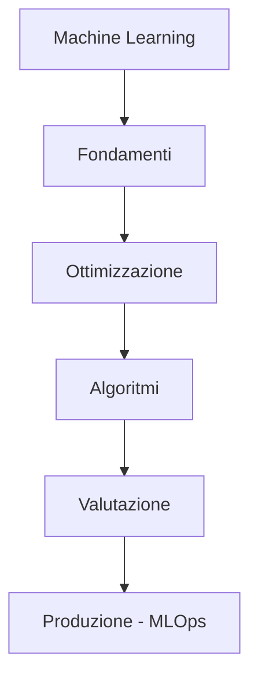
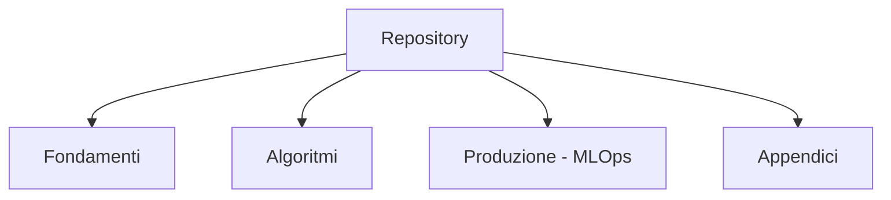
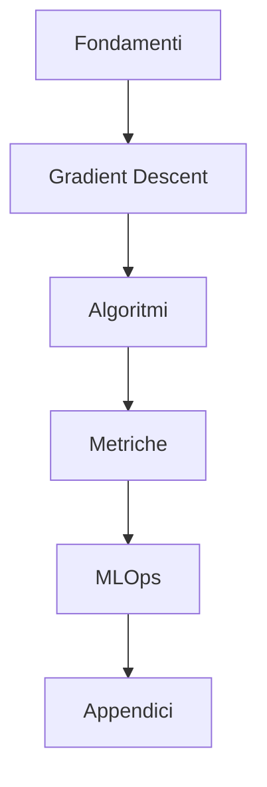
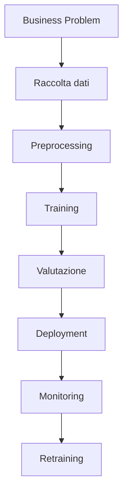
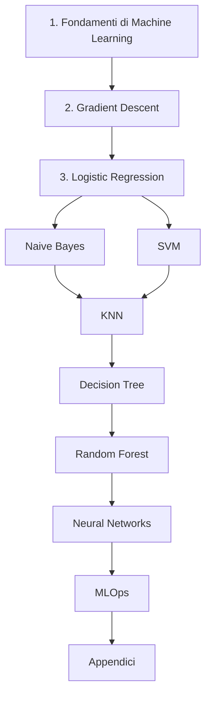
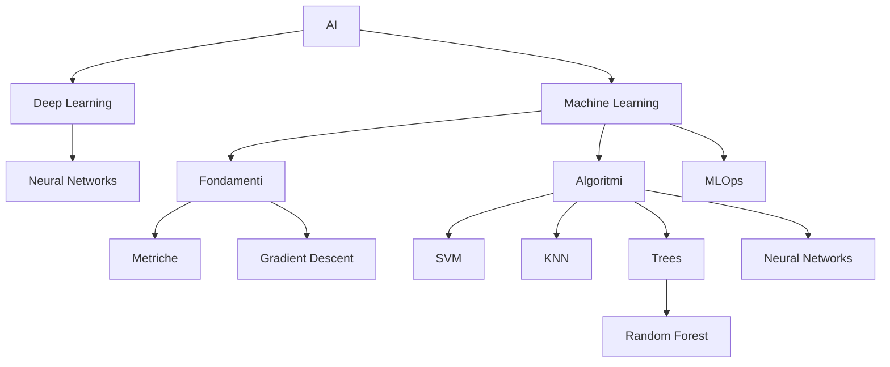
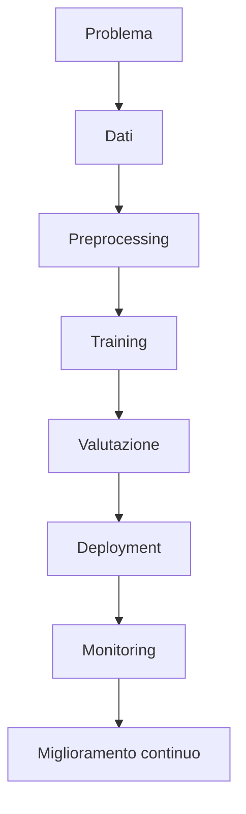

# Master Summary

Sintesi finale del percorso Master AI Engineering.

## Obiettivo

Questo documento rappresenta la sintesi conclusiva del repository.

A differenza dei singoli capitoli, che approfondiscono argomenti specifici, il Master Summary offre una visione d'insieme dell'intero percorso di studio.

Obiettivi principali:

- ripassare rapidamente tutti gli argomenti;
- evidenziare le relazioni tra i concetti;
- fornire una guida alla consultazione del repository;
- costituire il punto di ingresso per futuri aggiornamenti.

## Il percorso del Master

L'intero percorso puo essere sintetizzato cosi:

Ogni capitolo costruisce le basi necessarie per comprendere il successivo.

## Struttura del repository

Il repository e organizzato in quattro macro-sezioni:

## Sintesi dei capitoli

### Fondamenti

Il capitolo introduttivo presenta i concetti essenziali del Machine Learning.

Argomenti principali:

- dataset;
- feature;
- target;
- train/test split;
- overfitting;
- underfitting;
- bias;
- variance;
- metriche di valutazione;
- cross validation.

Questo capitolo costituisce il prerequisito per tutti gli altri.

### Ottimizzazione

Il secondo passo riguarda il processo di apprendimento del modello.

Il Gradient Descent introduce:

- funzione di costo;
- gradiente;
- learning rate;
- aggiornamento dei pesi;
- convergenza.

Questi concetti vengono poi riutilizzati nella Logistic Regression e nelle Neural Networks.

### Algoritmi studiati

Durante il Master sono stati analizzati i principali algoritmi supervisionati.

| Algoritmo | Principio fondamentale |
|---|---|
| Logistic Regression | Modello lineare probabilistico |
| Naive Bayes | Probabilita |
| SVM | Massimo margine |
| KNN | Distanza tra osservazioni |
| Decision Tree | Regole decisionali |
| Random Forest | Ensemble di alberi |
| Neural Networks | Apprendimento mediante pesi e funzioni di attivazione |

Ogni algoritmo presenta punti di forza e limiti specifici.

### Metriche

Tutti i modelli vengono valutati mediante metriche comuni.

Classificazione:

- Accuracy;
- Precision;
- Recall;
- F1-Score;
- Confusion Matrix;
- ROC Curve;
- AUC.

Regressione:

- MAE;
- MSE;
- RMSE;
- R2.

### MLOps

L'ultima parte del percorso affronta il ciclo di vita di un modello in produzione.

Argomenti principali:

- versionamento;
- deployment;
- FastAPI;
- Docker;
- Kubernetes;
- Model Registry;
- Monitoring;
- Retraining.

L'obiettivo e trasformare un modello addestrato in un servizio realmente utilizzabile.

### Appendici

Il repository comprende anche una serie di documenti di supporto.

| Documento | Scopo |
|---|---|
| formulario.md | Formule principali |
| glossario.md | Definizioni |
| knowledge-graph.md | Relazioni tra i concetti |
| comparison.md | Confronto tra algoritmi |

Le appendici non introducono nuovi argomenti, ma facilitano lo studio e il ripasso.

## Visione complessiva

Questa rappresenta la progressione logica seguita durante il Master.

## Le idee fondamentali del Master

L'intero percorso puo essere ricondotto ad alcune idee chiave. Comprendere questi concetti significa comprendere gran parte del Machine Learning moderno.

### Idea 1 - I dati sono piu importanti dell'algoritmo

Un algoritmo sofisticato non puo compensare dati di scarsa qualita.

Un dataset ben costruito, pulito e rappresentativo produce spesso risultati migliori rispetto ad algoritmi molto complessi applicati a dati inadeguati.

Per questo motivo il preprocessing rappresenta una fase essenziale di qualsiasi progetto di Machine Learning.

### Idea 2 - Non esiste un algoritmo migliore in assoluto

Ogni algoritmo presenta vantaggi e limiti.

La scelta dipende da fattori quali:

- dimensione del dataset;
- tipo di feature;
- interpretabilita richiesta;
- tempo disponibile;
- accuratezza desiderata;
- risorse computazionali.

La domanda corretta non e "Qual e il miglior algoritmo?" ma "Qual e l'algoritmo piu adatto a questo problema?".

### Idea 3 - L'overfitting e il nemico principale

Un modello deve essere in grado di generalizzare. Memorizzare il training set non significa aver appreso il problema.

Per questo motivo vengono utilizzati:

- train/test split;
- validation set;
- cross validation;
- regolarizzazione;
- early stopping.

### Idea 4 - Il preprocessing e parte del modello

Pulizia dei dati, gestione dei valori mancanti, encoding e scaling non sono operazioni accessorie.

Sono parte integrante del processo di apprendimento.

Un preprocessing scorretto puo compromettere completamente le prestazioni del modello.

### Idea 5 - Le metriche guidano le decisioni

Un modello non viene giudicato "a sensazione": le decisioni devono essere basate su metriche oggettive.

Metriche principali:

- Accuracy;
- Precision;
- Recall;
- F1-Score;
- ROC-AUC.

Nei problemi di regressione:

- MAE;
- MSE;
- RMSE;
- R2.

La scelta della metrica dipende sempre dal problema applicativo.

### Idea 6 - Il Machine Learning e ottimizzazione

Dietro quasi tutti gli algoritmi studiati esiste un problema di ottimizzazione.

L'obiettivo consiste nel minimizzare una funzione di costo.

Il Gradient Descent rappresenta uno dei metodi piu importanti per raggiungere questo obiettivo.

### Idea 7 - Gli algoritmi risolvono lo stesso problema in modi diversi

Durante il Master sono stati studiati approcci differenti alla classificazione.

| Algoritmo | Idea fondamentale |
|---|---|
| Logistic Regression | modello lineare probabilistico |
| Naive Bayes | probabilita condizionata |
| SVM | massimo margine |
| KNN | vicini piu simili |
| Decision Tree | regole decisionali |
| Random Forest | aggregazione di alberi |
| Neural Networks | apprendimento distribuito |

Non esiste una strategia universalmente superiore: ogni approccio risulta efficace in contesti differenti.

### Idea 8 - Le reti neurali estendono i modelli classici

Le Neural Networks non rappresentano una rottura con gli algoritmi precedenti.

Molti concetti sono gli stessi:

- pesi;
- bias;
- funzione di costo;
- Gradient Descent;
- ottimizzazione.

Le reti neurali aggiungono:

- piu livelli;
- funzioni di attivazione;
- maggiore capacita di rappresentazione.

### Idea 9 - Addestrare un modello non conclude il lavoro

Un modello addestrato non e automaticamente pronto per essere utilizzato.

E necessario:

- versionarlo;
- distribuirlo;
- monitorarlo;
- aggiornarlo;
- riaddestrarlo quando necessario.

Questo insieme di attivita costituisce il dominio di MLOps.

### Idea 10 - Il Machine Learning e un processo

Un progetto reale non consiste nell'esecuzione di un algoritmo. Il flusso completo comprende:

L'algoritmo rappresenta soltanto una fase di questo processo.

## Roadmap di apprendimento

Il repository puo essere affrontato seguendo una progressione naturale:

Questo ordine consente di costruire gradualmente le competenze richieste, evitando di affrontare argomenti avanzati senza aver consolidato le basi teoriche.

## Mappa mentale finale

## Competenze sviluppate

Al termine dello studio il lettore dovrebbe aver acquisito competenze in quattro aree principali.

### Fondamenti teorici

- concetti fondamentali del Machine Learning;
- differenza tra classificazione e regressione;
- metriche di valutazione;
- bias e variance;
- overfitting e underfitting.

### Algoritmi

Capacita di comprendere, confrontare e utilizzare:

- Logistic Regression;
- Naive Bayes;
- Support Vector Machine;
- K-Nearest Neighbors;
- Decision Tree;
- Random Forest;
- Neural Networks.

### Produzione

Conoscenza delle principali pratiche di MLOps:

- versionamento;
- deployment;
- FastAPI;
- Docker;
- Kubernetes;
- monitoring;
- retraining.

### Metodo

Capacita di affrontare un progetto di Machine Learning seguendo un workflow strutturato.

## Checklist di autovalutazione

Prima di considerare concluso il percorso, verifica di saper rispondere alle seguenti domande.

### Fondamenti

- [ ] So distinguere classificazione e regressione?
- [ ] So spiegare cosa sono feature e target?
- [ ] So descrivere overfitting e underfitting?
- [ ] So interpretare Accuracy, Precision e Recall?
- [ ] So spiegare il Bias-Variance Tradeoff?

### Algoritmi

- [ ] So spiegare quando usare Logistic Regression?
- [ ] So descrivere il Teorema di Bayes?
- [ ] So spiegare il kernel trick nelle SVM?
- [ ] So motivare la scelta di Random Forest rispetto a Decision Tree?
- [ ] So descrivere il funzionamento di KNN?
- [ ] So spiegare il ruolo del Gradient Descent?
- [ ] So descrivere il funzionamento di una rete neurale?

### MLOps

- [ ] So distinguere training e inference?
- [ ] So spiegare cos'e il deployment?
- [ ] So descrivere il ruolo del monitoring?
- [ ] So spiegare cosa sono Data Drift e Concept Drift?
- [ ] So descrivere il ciclo di vita di un modello?

### Visione complessiva

- [ ] So scegliere un algoritmo in base al problema?
- [ ] So motivare la mia scelta?
- [ ] So identificare il preprocessing necessario?
- [ ] So interpretare le metriche ottenute?
- [ ] So descrivere il workflow completo di un progetto ML?

Se la risposta e "si" alla maggior parte di queste domande, il percorso del Master puo considerarsi consolidato.

## Come utilizzare il repository

Il repository puo essere consultato con modalita differenti.

### Studio progressivo

Seguire l'ordine dei capitoli.

E il percorso consigliato per chi affronta il Machine Learning per la prima volta.

### Ripasso

Consultare nell'ordine:

1. master-summary.md
2. knowledge-graph.md
3. comparison.md
4. formulario.md
5. glossario.md

### Consultazione rapida

Per un dubbio specifico:

- utilizzare il Glossario per la terminologia;
- il Formulario per le formule;
- il Comparison Guide per scegliere un algoritmo;
- il Knowledge Graph per individuare le relazioni tra gli argomenti.

## Possibili sviluppi futuri

Il repository potra essere esteso con nuovi argomenti, ad esempio:

- Ensemble Learning avanzato (XGBoost, LightGBM, CatBoost);
- Clustering (K-Means, DBSCAN, Hierarchical Clustering);
- PCA e riduzione della dimensionalita;
- Reinforcement Learning;
- Large Language Models;
- Retrieval-Augmented Generation (RAG);
- Agenti AI;
- Explainable AI (XAI).

La struttura attuale e gia predisposta per integrare nuovi capitoli senza modificare quelli esistenti.

## Conclusioni

Il Machine Learning non consiste nell'apprendere un insieme di algoritmi isolati.

E un metodo per affrontare problemi attraverso:

- dati;
- modelli;
- valutazione;
- miglioramento continuo.

Gli algoritmi rappresentano strumenti.

La capacita piu importante consiste nel comprendere quale strumento utilizzare, come valutarne i risultati e come mantenerlo efficace nel tempo.

Questo repository nasce con l'obiettivo di accompagnare il lettore in questo percorso, fornendo sia una base teorica sia strumenti pratici di consultazione e ripasso.

## Stato editoriale

**Stato:** FINAL 1.0

Il documento Master Summary costituisce la sintesi conclusiva del repository.

Riassume i concetti fondamentali del Master AI Engineering, collega i diversi capitoli e fornisce una guida alla consultazione del materiale.

Dovra essere aggiornato solo in caso di:

- introduzione di nuovi capitoli;
- riorganizzazione del repository;
- ampliamento del programma del Master.
